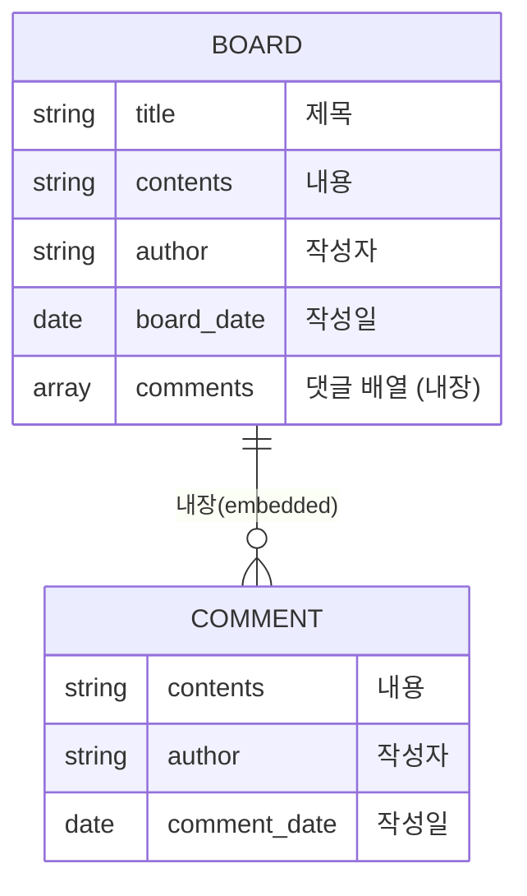

<div align="center">

# Express 블로그 (게시판)

[](../../기술_용어집.md#nodejs)
[](../../기술_용어집.md#nodejs)
[](../../기술_용어집.md#mongodb)
[](../../기술_용어집.md#mongodb)

**2021-06-09 ~ 06-15** · 학부 웹 프로그래밍 실습

</div>

---

Node.js + MongoDB로 만든 **개인 블로그(게시판)** 입니다. 화면에 "용이의 BLOG"라고
띄웁니다. 글을 쓰고 읽고, 각 글에 댓글을 다는 기능까지 구현했습니다.

> **폴더 이름 주의** — 원래 폴더명이 `express-locallibrary-tutorial` 이었습니다.
> MDN의 Express 튜토리얼(도서관 앱)을 따라 하며 시작했기 때문인데,
> **실제로 만든 것은 도서관이 아니라 블로그/게시판**입니다. 튜토리얼로 골격을
>잡은 뒤 내용은 다르게 갔습니다.

---

## 날짜별 작업 내용

파일 타임스탬프로 확인한 실제 작업 순섭니다.

| 날짜 | 시각 | 무엇을 했나 |
|---|---|---|
| **06-09** | 22:12~22:18 | Express 프로젝트 생성 (`bin/www`, `routes/users.js`, `package.json`) |
| **06-09** | 22:22 | **Mongoose 스키마 설계** — `models/board.js`, `models/comment.js` |
| **06-09** | 22:46~22:47 | MongoDB 연결 설정(`app.js`), 오류 화면 |
| **06-11** | 17:17~18:12 | **라우터 구현** — 글 목록·작성·조회·댓글 (`routes/index.js`), 목록 화면 |
| **06-15** | 20:55~20:58 | **글 상세·작성 화면** 완성 (`views/board.ejs`, `views/write.ejs`) |

즉 **설계(06-09) → 로직(06-11) → 화면(06-15)** 순서로 6일에 걸쳐 만들었습니다.

---

## 데이터 모델

게시글 안에 댓글을 **내장 문서(embedded document)** 로 넣었습니다. MongoDB가
관계형 DB와 다른 지점을 처음 체감한 부분입니다.



관계형 DB였다면 댓글을 별도 테이블로 두고 외래키로 이었겠지만,
여기서는 `$push` 연산으로 게시글 문서 안 배열에 직접 밀어 넣습니다.

```js
Board.findOneAndUpdate({_id: req.body.id}, { $push: { comments: comment } }, ...)
```

---

## 구현한 기능

| 경로 | 방식 | 하는 일 |
|---|:-:|---|
| `/` | GET | 글 목록 — `Board.find({})` |
| `/write` | GET | 글쓰기 화면 |
| `/board/write` | POST | 글 저장 |
| `/board/:id` | GET | 글 상세 (댓글 포함) |
| `/comment/write` | POST | 댓글 추가 (`$push`) |

---

## 폴더 구성

| 폴더 | 내용 |
|---|---|
| [`원본/`](원본/) | ⭐ **실제로 만든 앱.** 모델·라우터·EJS 화면이 모두 들어 있다 |
| [`복구/`](복구/) | Express 제너레이터 골격만 남은 부분 복구본. **모델과 화면이 빠져 있어** 그대로는 안 돌아간다 |
| `201119160이지용 실행화면-*.PNG` | 제출용 실행화면 캡처 4장 |

> `복구/`는 원본을 잃어버렸다가 일부만 되살린 흔적입니다. 뷰 엔진도 원본(EJS)과
> 달리 pug로 되어 있습니다. 실제 결과물을 보려면 **`원본/`** 을 봐야 합니다.

---

## 실행 방법

```bash
cd 원본
npm install          # node_modules는 저장소에 없다
npm start            # http://localhost:3000
```

> ⚠ MongoDB가 로컬에 떠 있어야 합니다. 접속 주소는 `app.js`에 있습니다
> (`mongodb://127.0.0.1:27017/kababdb`).

---

## 지금 보면 아쉬운 점

당시 코드를 지금 기준으로 보면 이런 것들이 눈에 띕니다. 고치지 않고 **그때
수준을 그대로 남겨** 성장 과정이 보이게 두었습니다.

- `var` 사용, 콜백 중첩 (지금이라면 `const`/`async-await`)
- 오류 처리가 `console.log` 후 리다이렉트뿐
- `models/comment.js`가 정의만 되고 실제로는 board의 내장 스키마를 씁니다
- 입력값 검증이 없습니다
