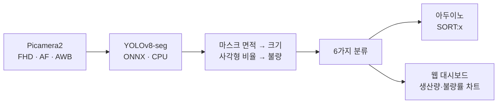

# 라즈베리파이 객체인식 → 아두이노 선별 시스템

**캡스톤 디자인 1단계** · 2025년 2학기

---

카메라로 물체를 인식해 **크기(대/중/소)와 불량 여부를 판정**하고,
결과를 아두이노로 보내 **분류기를 제어**하는 시스템입니다.
**그래픽카드가 없는 라즈베리파이에서 YOLOv8-seg를 CPU로** 돌리는 것이 핵심 과제였습니다.

> ★ **캡스톤 디자인 프로젝트의 1단계**입니다. 여기서 라즈베리파이의 성능 한계를
> 확인한 것이 다음 학기 [2단계(젯슨나노 + TensorRT)](../../2026/03.%20캡스톤%20-%20스마트팩토리%20비전검사/)로
> 이어졌습니다. 두 폴더를 함께 보면 **같은 문제를 하드웨어를 바꿔가며 푼 1년치 흐름**이 보입니다.

---

## 버전별 발전 과정

**같은 기능의 세 세대**가 남아 있어 개선 과정을 볼 수 있습니다.

| 파일 | 역할 | 특징 |
|---|---|---|
| `app_base.py` | 초기(Base) | 인식된 픽셀을 **3D 물리 좌표로 변환**해 `MOVE:x,y,z`를 보낸다 |
| `app_ck.py` | 메인 제어 | 마스크 면적(크기)과 사각형 비율(R값)로 **대/중/소 × 정상/불량 6가지**로 나눠 `SORT:x`를 보낸다 |
| **`sucess.py`** | ★ **최종 안정판** | 불량 판별 기준을 강화하고, 무게중심 계산을 정확히 하고, 타겟 고정 시 **빨간 십자선 UI**를 띄운다 |

---

## 폴더 구조

| 폴더 | 내용 |
|---|---|
| [**`RPI-Flask-main/`**](RPI-Flask-main/) | ★ **라즈베리파이 본체.** Flask와 YOLOv8-seg(ONNX)를 **CPU로** 돌린다 |
| [`FastAPI_GPU버전-수정본/`](FastAPI_GPU버전-수정본/) | **GPU 버전.** 젯슨으로 옮겨 FastAPI + TensorRT 가속에 Gemini 관제 챗봇을 더했다 |
| [`sub/`](sub/) | 학습 데이터 실험 (1000장 / 1500장 세트) |
| [`Classfication_fruit.v1i.yolov8/`](Classfication_fruit.v1i.yolov8/) | Roboflow 학습용 데이터셋 (YOLOv8 포맷) |

---

## 주요 파일

| 파일 | 설명 |
|---|---|
| `RPI-Flask-main/camera.py` | 라즈베리파이 전용 카메라 모듈. **Picamera2**로 FHD·오토포커스(AF)·화이트밸런스(AWB)를 하드웨어 레벨에서 초기화한다 |
| `FastAPI_GPU버전-수정본/camera.py` | **하이브리드 카메라 래퍼.** RealSense 연결을 먼저 시도하고 **실패하면 자동으로 USB 웹캠으로 폴백**하는 고가용성 구좁니다. 백그라운드 스레드로 읽어 서버 부하를 줄인다 |
| `index.html` | 웹 관제 대시보드 — 실시간 스트리밍, CPU/메모리/FPS, 시스템 제어 버튼, **생산량·불량률 동적 차트(Chart.js)** |
| `prototype.py`, `send_test.py` | 외부 중앙 서버로 탐지 결과를 HTTP POST로 보내는 통신 테스트 |

★ 이때 겪은 **"자원이 부족한 보드에서 AI를 어떻게 돌릴 것인가"** 문제의식이
[캡스톤 2단계의 TensorRT 최적화](../../2026/03.%20캡스톤%20-%20스마트팩토리%20비전검사/)와
[광명테크 인턴의 OpenVINO 전환](../../2026/01.%20광명테크%20인턴%20-%20배리어프리%20키오스크/)으로 이어졌습니다.

## 1단계 → 2단계

| | 1단계 (여기, 2025) | [2단계 (2026)](../../2026/03.%20캡스톤%20-%20스마트팩토리%20비전검사/) |
|---|---|---|
| 보드 | Raspberry Pi (GPU 없음) | Jetson Orin Nano (GPU) |
| 추론 | ONNX Runtime, **CPU** | **TensorRT FP16**, GPU |
| 서버 | Flask | FastAPI (멀티스레딩) |
| 카메라 | 1대 (Picamera2) | **2대 병렬** (RealSense + USB) |
| 판정 | 크기·불량 6분류 | 박스 분류 + **무게 숫자 인식** |
| 마무리 | 학기 종료 | **최종 전시회 출품** |

파일별 상세 설명은 [`RPI-Flask-main/코드설명.md`](RPI-Flask-main/코드설명.md) ·
[`FastAPI_GPU버전-수정본/코드설명.md`](FastAPI_GPU버전-수정본/코드설명.md) 참고.
