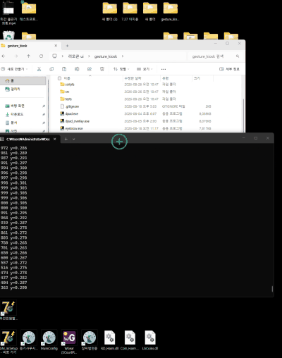
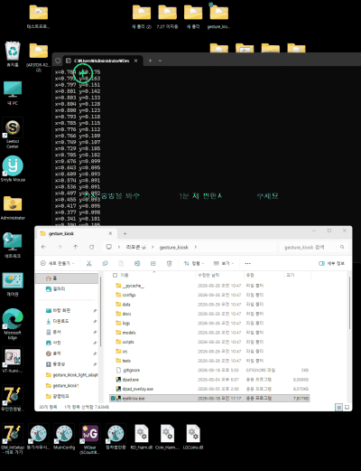
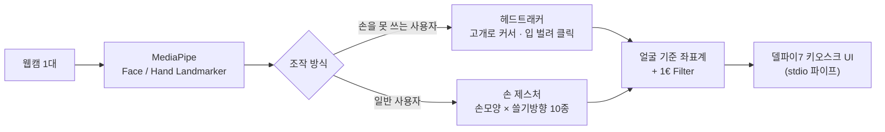
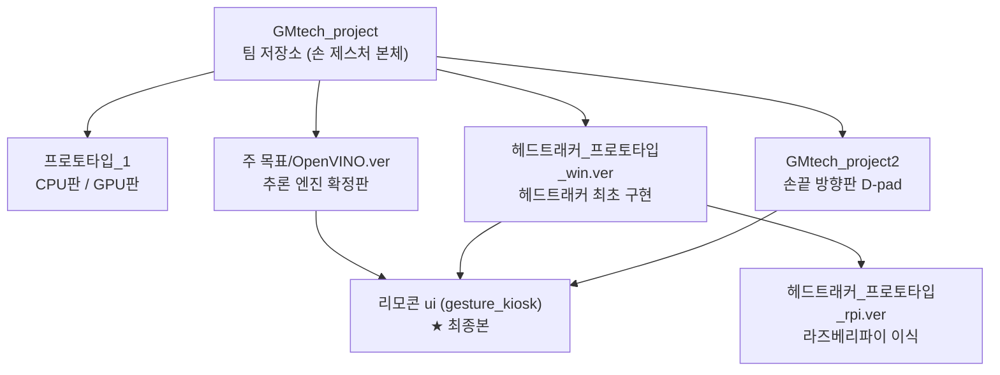

# 광명테크 인턴 — 배리어프리 키오스크 입력 장치

**(주)광명테크 인턴 프로젝트** · `2026.07 ~ 08`

---

동사무소나 법원에 놓이는 무인 민원발급기를, 손을 쓰기 어려운 사용자도 쓸 수 있게
만드는 입력 장치입니다. **일반 웹캠 한 대만** 쓰고 센서는 따로 달지 않습니다.
이 저장소에서 가장 오래, 가장 깊이 붙잡고 있던 일입니다.

<table>
<tr>
<td align="center" width="50%"> <b>코끝 기준</b>(<code>head.py</code>) · 조명 켠 방</td>
<td align="center" width="50%"> <b>미간 기준</b>(<code>eyebrow.py</code>) · 조명 끈 방</td>
</tr>
</table>

헤드트래커로 조작하는 세로 화면을 녹화했습니다(2배속). 초록 커서가 고개를 따라가고,
입을 벌려 누르면 파란색으로 바뀌며 창을 끌어 옮깁니다.
원본 영상 — <a href="리모콘%20ui/코%20불킨거%20최종버전.mp4">코끝</a> · <a href="리모콘%20ui/미간%20불끈거%20최종.mp4">미간</a>

| 조작 방식 | 어떻게 쓰나 | 누구를 위한 것 |
|---|---|---|
| **헤드트래커** | 고개를 움직여 커서를 옮기고, **입을 벌려 클릭**합니다. 1.5초 응시로도 클릭됩니다 | 손을 쓸 수 없는 사용자 |
| **손 제스처** | 손 모양(한 손가락 / 주먹 / 손바닥)과 쓸기 방향을 조합해 10종 명령을 냅니다 | 일반 사용자 |

---

## 수치로 본 결과

| 항목 | 이전 | 이후 | 개선 |
|---|:-:|:-:|:-:|
| 배포 용량 | 8 GB | **1.1 GB** | 86% 감소 |
| 화면 1프레임 렌더링 | 19.8 ms | **10.4 ms** | 47% 단축 |
| 몸이 움직일 때 커서 오차 | 밀려감 | **0 px** | 원리적 해결 |
| 입 벌릴 때 커서 오차 | 밀려남 | **0.00 px** | 해결 |
| 드래그 중 커서 떨림 | 2.05 px | **0.78 px** | 62% 감소 |
| 카메라 고장 시 | 조용히 정지 | **4초 내 자동 복구** | — |
| 오류 40초치 로그량 | 약 1,200줄 | **2줄** | 99% 감소 |
| 렌더 프레임 | 30 fps | **60 fps** | 2배 |

---

## 폴더 계보 — 같은 프로젝트의 여러 세대

| 폴더 | 무엇인가 | 시기 |
|---|---|:-:|
| [**`리모콘 ui/`**](리모콘%20ui/) | ★ **최종 결과물.** 헤드트래커 3종(`head.py` 코끝 / `eyebrow.py` 미간 / `forehead.py` 코-눈 혼합점)과 손 제스처, 실시간 튜닝 UI가 들어 있습니다 | `8월 하순` |
| [**`광명테크 개발 일지/`**](광명테크%20개발%20일지/) | ★ **날짜별 개발일지 42편.** 문제·원인·해결·측정값을 매일 기록했습니다. 오류 모음·용어 정리·참고 논문 정리도 같이 있습니다 | `7~8월` |
| [`주 목표/OpenVINO.ver/`](주%20목표/OpenVINO.ver/) | 추론 엔진 확정판. 인텔 CPU와 내장 그래픽만 쓰는 구성입니다(키오스크에 별도 GPU가 없습니다). **커밋 75건으로 기록이 가장 촘촘합니다** | `7/06~7/24` |
| [`GMtech_project/`](GMtech_project/) | 팀 본체 저장소(손 제스처). 이 위에 헤드트래커를 얹었습니다 | `7/23~8/04` |
| [`GMtech_project2/`](GMtech_project2/) | 손끝 방향판(D-pad) 갈래 | `8월 초` |
| [`헤드트래커_프로토타입_win.ver/`](헤드트래커_프로토타입_win.ver/) | 헤드트래커를 처음 만든 곳 | `7월 중순` |
| [`헤드트래커_프로토타입_rpi.ver/`](헤드트래커_프로토타입_rpi.ver/) | 라즈베리파이 5 이식 | `7/22` |
| [`프로토타입_1/`](프로토타입_1/) | GPU 있는 판과 없는 판으로 나눈 초기 갈래 | `7/13` |
| [`gesture_model/`](gesture_model/) | 가장 초기 실험 — 손 제스처 분류 모델 학습 | `7월 초` |
| [`광명테크 ppt 일지 자료/`](광명테크%20ppt%20일지%20자료/) | 주차별 세미나·중간보고·최종보고서, 시연 영상, 산업인턴 업무일지 | `7~9월` |

---

## 기술적으로 신경 쓴 부분

<b>① 얼굴 기준 좌표계 (face-local frame)</b>

 

커서 위치를 화면이 아니라 **얼굴 자신을 기준으로** 계산하도록 다시 설계했습니다.
두 눈을 잇는 선을 얼굴의 좌표축으로 삼고 안구간 거리로 나누면, 몸이 움직여도 눈과 코가
*함께* 움직이므로 얼굴 좌표계 안의 값은 그대로입니다.

그래서 **"가만히 있어도 커서가 밀려간다"는 문제가 원리적으로 사라집니다**(표의 `0 px`).

<b>② 오발 방지를 규칙 자체에 내장</b>

 

**손 모양이 계층을(탐색/명령), 이동 방향이 기능을** 정합니다.
탐색(한 손가락)은 아무리 반복해도 화면이 안 바뀌고, 화면을 바꾸려면 주먹을 쥐어야 합니다.
실수로 화면이 넘어가는 사고를 **구조적으로** 막았습니다.

<b>③ 무인 운영 안정성</b>

 

| 상황 | 대응 |
|---|---|
| 카메라가 죽음 | **4초 내 자동 복구** |
| 스레드가 멈춤 | 감시 장치(watchdog)가 화면에 알립니다 |
| 같은 오류 반복 | 로그를 접어서 기록합니다 (1,200줄 → **2줄**) |
| 로그 무한 증가 | 파일 **20 MB 상한** |
| 강제 종료 | 다음 실행 때 마우스 커서를 자동 복구합니다 |

<b>④ 적용 기술의 출처를 밝힘</b>

 

| 기법 | 출처 | 어디에 썼나 |
|---|---|---|
| **1€ Filter** | Casiez, Roussel, Vogel — *ACM CHI 2012* | 커서 떨림 제거 (속도 적응형) |
| **CLAHE** | Zuiderveld — *Graphics Gems IV, 1994* | 저조도 환경 인식률 개선 |
| **ISO 9241-411:2012** | 국제 표준 | 포인팅 장치 처리량 측정 |
| **중앙값 캘리브레이션** | 로버스트 통계 | 눈 깜빡임 등 이상치 제거 |
| **히스테리시스 + 쿨다운** | 제어·신호처리 | 입 벌림·눈 감김 판정 오발 방지 |
| **MiDaS** | Ranftl et al. — Intel ISL | 단안 깊이 추정 (대안 검증) |

---

## 대표 문제 해결

| 문제 | 어떻게 풀었나 |
|---|---|
| **깊이 센서 없이 "조작하는 사람"만 구별** | 줄 선 뒷사람 손이 같이 인식돼 조작권이 넘어갔습니다. 앵커 고정 → 크기 기반 거리 추정 → 팔 길이 제약 → **배경 블러로 모델이 아예 다른 사람을 못 보게 하는 방식**까지 5단계를 시도했습니다. 따로 단안 깊이 추정(MiDaS)까지 만들어 보고 **근본 대안을 보고서로 제출**했습니다 |
| **성능 가설을 두 번 오판** | "다른 프로그램이 CPU를 써서 느리다"는 가설로 최적화했지만 실패했습니다. 항목별로 실측하니 **다른 스레드가 놀아도 항상 15~16 ms**가 나왔고, 추적 끝에 **윈도우 타이머의 최소 단위**(15.6 ms)가 병목임을 찾아 대기 방식을 바꿔 **19.8 → 10.4 ms**로 줄였습니다 |
| **어림값 대신 측정 도구를 제작** | 커서가 좌우로 움직일 때 포물선으로 휘는 문제를 어림값으로 두 번 고치려다 악화시켰습니다. 곡률 실측 도구(`measure_arc.py`)를 만들어 2차 회귀분석으로 계수를 구했고, 그 과정에서 **보정식이 화면 끝을 넘으면 발산하는 진짜 버그**를 찾아 근본 수정하고 **회귀 테스트**를 남겼습니다. 이 곡률 보정은 8월 말 상대 회전 매핑으로 바꾸면서 필요 없어졌습니다(아래) |
| **출시 전에 시험 환경부터 의심** | 시험은 전부 통과했는데, 키오스크에 깔리는 버전 조합(OpenCV 4.10)으로 다시 돌리자 **렌즈 보정 한 번에 20초**가 걸렸습니다(개발 PC의 5.0은 0.1초대). 설치 버전을 올리고, 키오스크에 까는 방식 그대로 다시 깔아 검증했습니다. 오래 켜 두는 시험에서 한 트래커만 실패한 것도 원인을 재현해 보니 **시험 도구가 확인할 기록을 지우고 있었습니다** |

---

## 인턴 이후 — 출시 준비 (2026.09)

인턴은 8월 말에 끝났지만 헤드트래커는 실제 키오스크에 들어갈 제품이라 9월에도 이어서
다듬었습니다. 아래 수치는 **가상 카메라·가상 사용자로 측정한 시뮬레이션 값**입니다
(실제 장치 측정치와 섞지 않았습니다 — [측정 자료](리모콘%20ui/gesture_kiosk/데이터%20수치/00_README.md)).

| 한 일 | 결과 |
|---|---|
| **상대 회전 매핑** — 시작할 때 잡은 중립 자세에 대한 고개 회전으로 커서를 정합니다(Kabsch-Umeyama) | 카메라를 어디에 어떻게 달아도 방향이 맞습니다 — 배치 9종 × 좌우 반전 켬/끔 **288/288** 통과. 좌우로 돌릴 때 커서가 휘던 문제의 곡률 보정이 필요 없어졌습니다 |
| **렌즈 자가 보정** — 사용자의 얼굴을 보정판 삼아 광각 카메라의 초점거리를 추정합니다 | 몸을 옆으로 옮길 때 커서가 끌려가는 양 **0.036~0.042 → 0.006~0.017** |
| **설치할 때 거리 하나만** — 모니터 실치수(EDID)와 사용자 거리로 커서 각도를 기하학으로 정합니다 | 얼굴이 향한 곳과 커서의 어긋남 평균 **6.4% → 3.1%**, 최악 **20.0% → 11.0%** |
| **가상 사용자로 클릭·드래그 재검증** | 클릭 뒤 입을 덜 다무는 사람에게 버튼이 눌린 채 남던 결함, 클릭 순간 커서가 끌려가던 결함을 찾아 고쳤습니다 |
| **출시 점검** (9/24~25) | 실행 즉시 죽던 빌드 도구 6개 등 오류를 고치고, 측정해 보니 효과가 없거나 해롭던 기법 5가지를 지웠습니다. 시험 **961건**, 세 트래커 **30분 연속 실행** 통과 |

전체 기록은 **[개발일지 INDEX](광명테크%20개발%20일지/INDEX.md)** ·
[오류 모음](광명테크%20개발%20일지/01_오류_모음.md) ·
[참고 논문·기술](광명테크%20개발%20일지/04_참고_논문_기술.md) 참고.

---

## 실행 환경

- **Windows + Python 3.11.5 — CPU 단독**. 정부 민원발급기에는 별도 그래픽카드가 없습니다
- 모델: MediaPipe FaceLandmarker / HandLandmarker (**Apache-2.0, 상업적 사용 가능**)
- UI 연동: **델파이 7** — stdio 파이프로 이벤트를 넘깁니다 (UDP → 웹소켓 → 파이프 순으로 바뀌었습니다)
