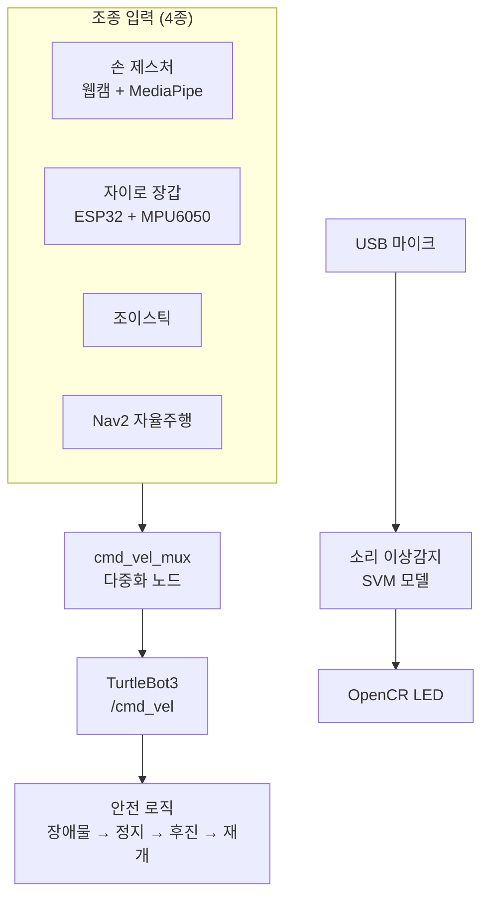

# SW파일럿 — TurtleBot3 자율주행 로봇

**2026 SW 파일럿 로보틱스 1팀** · 팀 프로젝트

---

TurtleBot3를 **네 가지 방식으로 조종**하고, 지도 기반으로 **스스로 순찰**하며,
**기계 소리로 이상을 감지**해 LED로 알리는 통합 로봇 시스템입니다.

## 구현 기능

| 기능 | 구현 내용 |
|---|---|
| **손 제스처 조종** | 웹캠 → MediaPipe 손 인식 → 손끝 위치를 D-pad 방향으로 매핑 → `/cmd_vel` 발행 |
| **자이로 장갑 조종** | ESP32 + MPU6050 장갑 펌웨어를 직접 작성하고, Wi-Fi로 기울기를 전송한다 |
| **조이스틱 조종** | 여러 입력 중 하나만 로봇에 전달하는 mux 노드를 설계했다 |
| **자율 순찰** | SLAM으로 공장 지도를 만들고, Nav2로 A→B→C→D→A 웨이포인트를 순찰한다 |
| **안전 로직** | 자율주행 중 장애물을 감지하면 정지 → 후진 → 재개하는 상태 머신 |
| **소리 이상감지** | USB 마이크로 기어박스 소리를 듣고 SVM 모델로 이상을 판정해 LED로 알린다 |
| **로봇팔 연동** | SO-101 6축 로봇팔을 사람 팔 동작으로 원격조종한다 |

## 폴더 구조

| 폴더 | 내용 |
|---|---|
| [**`로봇 프로젝트 본체/`**](로봇%20프로젝트%20본체/) | ★ **실제 로봇 프로젝트.** 제스처 파이프라인, ROS 2 노드, 펌웨어, 지도, 실행 스크립트, 단위 테스트, 작업 기록이 들어 있습니다. **상세 설명은 그 안의 README 참고** |
| `chapter 2/` | ROS 2 교육 실습 **13편** — 리눅스 기본부터 노드·토픽·퍼블리셔·서브스크라이버·launch까지 |
| `과정 1/` | 로봇 설계 과제 **9편** — 모터·휠·센서·엔코더·차동구동·제어·마이크로컨트롤러 |

## 엔지니어링 포인트

<b>하드웨어 없이도 검증되는 구조 — 펼쳐보기</b>

 

로봇이 없어도 로직을 검증할 수 있게 **GPIO·하드웨어 접근부와 판단 로직을 분리**했습니다.

단위 테스트로 검증하는 항목:
- 손 모양 판별 (21개 랜드마크 기하 규칙)
- D-pad 방향 매핑
- cmd_vel mux 우선순위 로직
- 웨이포인트 도착 판정
- LED 상태 머신 전이

<b>Jetson 이전 트러블슈팅 6건 — 펼쳐보기</b>

 

제어 컴퓨터를 Jetson Orin Nano로 옮기며 **6가지 문제가 겹쳐서** 터졌습니다.
각각을 **원인 → 조사 과정 → 수정 방법** 순으로 기록했습니다.

| # | 문제 |
|:-:|---|
| 1 | 조이스틱 패키지의 잘못된 rosdep 선언 |
| 2 | Conda / 시스템 Python 충돌 |
| 3 | 불완전한 빌드 잔재 |
| 4 | 모터 토크 비활성화 |
| 5 | 라이다 모델 설정 오류 |
| 6 | 라이다 포트 별칭 오류 |

최종적으로 OpenCR · LDS-03 라이다 · 조이스틱 · SLAM/Nav2가 **모두 정상 동작**하는
상태로 마무리했습니다. 당시 원본 로그와 수정된 설정 파일도 함께 보관되어 있습니다.

[트러블슈팅 문서 보기](로봇%20프로젝트%20본체/TurtleBot3_오류_분석_및_해결_2026-08-17/README.md)

---

> ⚠ `turtlebot3`, `DynamixelSDK`, `ld08_driver`, `coin_d4_driver` 등은
> **ROBOTIS 공식 오픈소스**다. 이 팀이 직접 작성한 것은
> `turtlebot3_waypoint_patrol`(순찰·안전정지), 제스처 파이프라인, ESP32 펌웨어,
> 소리 이상감지 패키지, LED 상태 노듭니다.
