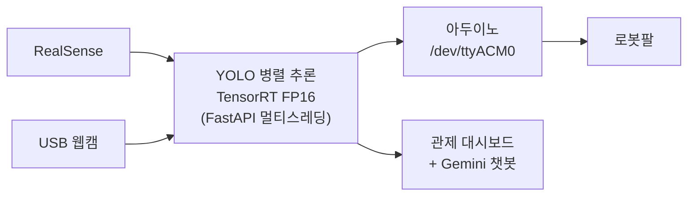

# 캡스톤 — 스마트팩토리 비전 검사 시스템

**캡스톤 디자인 2단계(최종)** · 2026년 1학기 · 최종 전시회 출품작

---

카메라 2대를 동시에 돌려 **박스를 분류**하고 **무게 숫자를 읽어**,
결과를 아두이노로 보내 **로봇팔을 제어**하는 시스템입니다.

> ★ **캡스톤 디자인의 2단계이자 최종 결과물**입니다. 1단계는
> [2025년 라즈베리파이 선별 시스템](../../2025/01.%20캡스톤%20-%20라즈베리파이%20선별시스템/)으로,
> 거기서 확인한 CPU 추론의 한계를 **젯슨나노 + TensorRT**로 넘어섰습니다.

---

## 이 프로젝트의 핵심 — 하드웨어 고장을 설계 변경으로 극복

원래 **CSI 카메라(IMX219)** 기반으로 GStreamer 파이프라인까지 완성해 뒀는데,
**CSI 포트가 물리적으로 고장** 났습니다.

Intel RealSense와 일반 USB 웹캠 조합으로 **아키텍처를 갈아엎고**, FastAPI 멀티스레딩으로
두 카메라의 YOLO 추론을 지연 없이 병렬 처리하도록 재설계해 **전시회를 완주**했습니다.
설계 변경 과정을 증명하려고 **기존 CSI 버전 코드도 함께 보관**했습니다.

---

## 파일별 설명

### 메인 서버 (발전 순서)

| 파일 | 설명 |
|---|---|
| **`project/jetson_USB2.py`**, `jetson_USB.py` | ★ **최종 완성본.** 듀얼 카메라 하이브리드 제어 서버. FastAPI 멀티스레딩으로 두 카메라의 YOLO 추론(무게 숫자 / 박스 분류)을 병렬 처리하고 아두이노 시리얼로 보낸다 |
| `project/jetson_csi_final.py`, `jetson_main1(9).py` | **Plan A 버전.** 하드웨어 파손 이전의 CSI 카메라 기반 코드. `nvarguscamerasrc` GStreamer 파이프라인으로 하드웨어 인코딩 영상을 가져오는 고성능 지향 설계였다 |
| `project/jetson_main1.py` | **초기 프로토타입.** 아두이노 시리얼 통신 규격(`MOVE:RIGHT` 등)을 확립하고 TensorRT 로딩을 최초로 테스트한 뼈대 코드 |

### AI 모델 최적화

| 파일 | 설명 |
|---|---|
| **`project/turnonnx.py`** | PyTorch(`.pt`)를 **TensorRT 엔진(`.engine`)** 으로 변환합니다. `half=True`로 **FP16 반정밀도 연산**을 켜서 추론 속도를 크게 끌어올린 핵심 최적화 코드다 |
| `project/box.*` / `number.*` | 박스 분류 / 무게 숫자 인식 모델 (`.pt` → `.onnx` → `.engine`) |

### 디버깅 도구

| 파일 | 설명 |
|---|---|
| `project/cam_check.py` | 듀얼 카메라 멀티스레딩 안정성 테스트. 두 카메라가 충돌 없이 YOLO 루프를 도는지, **프레임 락이 걸리지 않는지** 점검한다 |
| `project/imx.py` | 단일 카메라 연결 확인용 초경량 스크립트 |

### 프론트엔드

| 파일 | 설명 |
|---|---|
| **`project/index.html`** | 실시간 관제 UI. 듀얼 카메라를 동시에 스트리밍하고 CPU·FPS를 모니터링합니다. **챗봇으로 실시간 현장 데이터를 AI에게 물어** 공정 상태를 진단받을 수 있다 |

---

> ⚠ `project/lerobot/` 은 HuggingFace **lerobot 오픈소스**다(직접 작성한 코드가 아닙니다).
> 파일별 상세 설명 원본은 [`코드설명.md`](코드설명.md) 참고.
