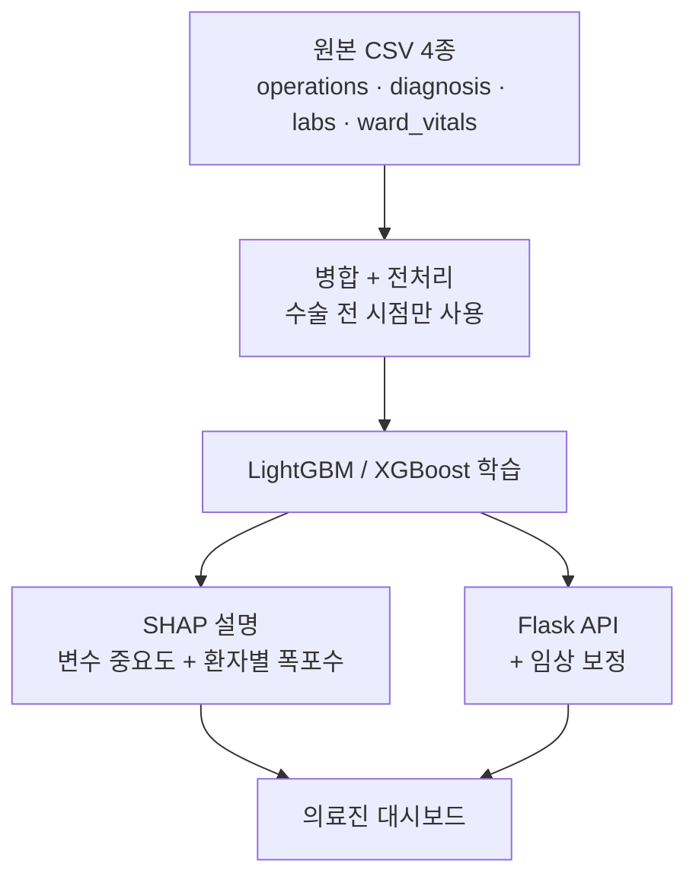

# 수술 위험도·예상시간 예측 AI

-0088CC?style=flat-square)

**머신러닝 대회** · `2026.05` · 데이터셋: **INSPIRE** (공개 수술기간 의료 데이터)

---

수술 기록·진단·검사·활력징후 데이터를 병합해 **두 가지를 동시에 예측**하고,
**왜 그렇게 판단했는지 의료진에게 설명**하는 시스템입니다.

| 예측 대상 | 문제 유형 | 모델 |
|---|:-:|---|
| **ICU 입원 위험도** | 분류 | LightGBM → **XGBoost로 교체(하이브리드)** |
| **수술 소요시간** | 회귀 | LightGBM |

---

## 가장 신경 쓴 세 가지

**① 데이터 누수 차단** — 의료 예측 모델에서 가장 흔한 실수가 **미래 정보를 학습에 섞는
것**입니다. `cutoff_time`을 엄격히 통제해 **수술 전 시점의 데이터만** 쓰도록 만들었습니다.
그래야 실제 수술 전에 쓸 수 있는 모델이 됩니다.

**② 설명가능 AI(XAI)** — 의료진이 "AI가 그렇다니까"만으로는 쓸 수 없습니다. SHAP으로
**전체 변수 중요도**와 **개별 환자 폭포수 차트**("이 환자는 왜 오래 걸리나")를
각각 시각화했습니다.

**③ 임상 보정** — AI가 내놓은 단순 확률값에 **ASA 등급·응급 여부·혈액검사 수치** 등
의료 지식을 더해 위험도를 보정하는 로직을 서버에 넣었습니다.

---

## 파일별 설명

### 학습 및 평가

| 파일 | 설명 |
|---|---|
| **`train.py`** | ★ 메인 학습 파이프라인. 원본을 병합·전처리한 뒤 LightGBM 분류·회귀 모델을 함께 학습시켜 `.pkl`로 저장한다 |
| `test.py` | 평가와 **SHAP 변수 중요도 추출**. 분류·회귀 각각의 Summary Plot을 만든다 |
| `model_cls.pkl` / `model_reg.pkl` | 학습된 분류 / 회귀 모델 |
| `encoders.pkl`, `features.pkl`, `medians.pkl` | 전처리 인코더·특성 정의·결측치 대체값 |
| `generate_lookup.py`, `icd10_pcs_lookup.pkl` | ICD-10 / PCS 의료 코드 매핑 |

### 시각화

| 파일 | 설명 |
|---|---|
| `visualize_metrics.py` | AUROC·Accuracy·Precision·F1 막대그래프. **OS를 자동 감지해 한글 폰트 깨짐을 막는다** |
| `visualize_regression.py` | 특정 환자 맞춤형 **SHAP 폭포수 차트**. 고령·ASA 4등급 같은 가상 환자의 결정 요인을 분석한다 |

### 서빙

| 파일 | 설명 |
|---|---|
| `server.py` | LightGBM 기반 Flask API에 **임상 보정 로직**을 붙였다 |
| `serverbro.py` | 업그레이드판. 수술시간은 LightGBM, **ICU 위험도는 XGBoost**로 교체한 하이브리드 구성이다 |
| **`index.html`** | 의료진 대시보드. 이미지 없이 **CSS/SVG만으로 원형 게이지와 애니메이션**을 구현했습니다. 위험도뿐 아니라 **최단·최장 수술시간, 결정적 요인, 종합 임상 소견**까지 브리핑한다 |
| `old/` | 대시보드 이전 버전들 (디자인 발전 과정) |

---

> ⚠ `AI/inspire-a-publicly-available-research-dataset-.../` 는 원본 공개 데이터셋이며,
> 해당 폴더의 `LICENSE.txt` 조건을 따릅니다.
> 파일별 상세 설명 원본은 [`AI  폴더 코드 설명.md`](AI%20%20폴더%20코드%20설명.md) 참고.
