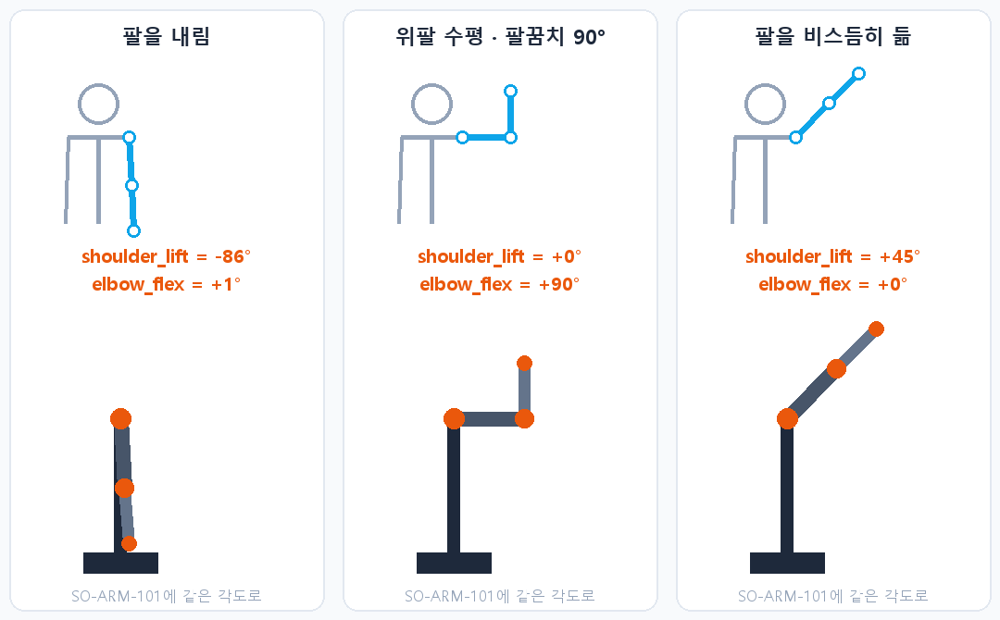

# 웹캠 하나로 로봇팔 원격조종

**장갑도 센서도 없이, 웹캠 한 대로 6축 로봇팔을 조종합니다** · `2026.08` · 개인 프로젝트

---

사람이 **팔꿈치를 90° 굽히면 로봇도 90° 굽는 것**이 목표였습니다. 비슷하게 따라
하게 만드는 것이 아니라, 사람 팔의 각도를 그대로 로봇 관절에 옮기려고 했습니다.

 
<b>원리 그림 — 실제 촬영이 아닙니다.</b> 1일차 버전의 관절각 계산(<code>MediaPipe-SO-ARM101/arm_tracker.py</code>,
정면 모드)에 가상의 어깨·팔꿈치·손목 좌표를 넣어 나온 값을 그대로 그렸습니다. 위는 사람 팔, 아래는 같은 각도로 움직인 로봇팔입니다

## 이틀에 걸쳐 만든 두 판

| | 1일차 (08-21) | 2일차 (08-29) |
|---|---|---|
| 폴더 | [`MediaPipe-SO-ARM101/`](MediaPipe-SO-ARM101/) | [`lerobot 연동판/`](lerobot%20연동판/) |
| 좌표 | 화면 2D 좌표(x, y)만 | MediaPipe의 **3D world landmark**(미터 단위)를 몸통 기준 좌표계에 투영 |
| 조명 | — | CLAHE + 적응형 감마로 어두운 곳 대응 |
| 그리퍼 | 손끝 사이 거리 (손을 돌리면 틀림) | 3D 손가락 관절각 (회전에 강함) |
| 관절각 떨림 | 7.2~10.0° | **2.3~3.7°** (48~78% 감소) |
| 처리 속도 | 9.5 FPS | **14.9 FPS** |

2D 좌표만 쓰면 팔을 카메라 쪽으로 뻗을 때 화면에서 팔 길이가 짧아져 각도가 뭉개집니다.
2일차에 3D로 바꾼 가장 큰 이유입니다. 2D 방식은 `--no-world` 옵션으로 남겨 뒀습니다.
날짜별 과정과 측정값은 [작업 일지](lerobot%20연동판/작업%20일지/README.md)에 있습니다.

## 관절 매핑

| 로봇 관절 | 사람 동작 | 계산 방식 (2D 기준) |
|---|---|---|
| `shoulder_pan` | 팔 좌우 | 손목의 어깨 대비 x 오프셋 ÷ 위팔 길이 |
| `shoulder_lift` | 팔 위아래 | `asin((어깨y − 팔꿈치y) ÷ 위팔 길이)` → 실제 각도 |
| `elbow_flex` | 팔꿈치 굽힘 | `180° − 위팔·아래팔 사잇각` (폄 0° ~ 최대 150°) |
| `wrist_flex` | 손목 꺾기 | 아래팔 벡터 대비 손바닥 벡터의 **부호 있는** 각도 |
| `wrist_roll` | 손 회전 | 기본은 고정 — 2D 좌표로는 진짜 회전축을 구할 수 없습니다(`--track-roll`로 켜면 손 폭 방향으로 근사) |
| `gripper` | 손 펴기/주먹 | 엄지 끝 ↔ 나머지 네 손가락 끝 평균 거리 ÷ 손바닥 길이 |

3D 판도 같은 생각입니다. 다만 화면 좌표 대신 몸통 기준 3D 벡터로 각도를 구합니다.

## 기술 포인트

| 항목 | 내용 |
|---|---|
| **떨림 제거** | **1€ Filter**(속도 적응형)와 **SmoothDamp**를 2단계로 걸었습니다 |
| **실시간 튜닝** | 실행 중 키보드로 방향·0점·배율을 조정하고 파일로 저장합니다 |
| **의존성 최소화** | 깊이 카메라나 IMU 장갑 없이 **일반 웹캠 한 대**면 됩니다 |

## 폴더

| 폴더 | 내용 |
|---|---|
| [`MediaPipe-SO-ARM101/`](MediaPipe-SO-ARM101/) | 1일차 판 — 2D 좌표 방식과 상세 문서 |
| [`lerobot 연동판/`](lerobot%20연동판/) | ★ 2일차 판 — 3D 좌표·조도 보정·그리퍼 개선, [작업 일지](lerobot%20연동판/작업%20일지/README.md) |

주요 파일은 `arm_tracker.py`(관절각 계산) · `teleop_so101.py`(로봇 전송) ·
`download_models.py`(MediaPipe 모델 받기) · `tuning.json`(조정값)입니다.
