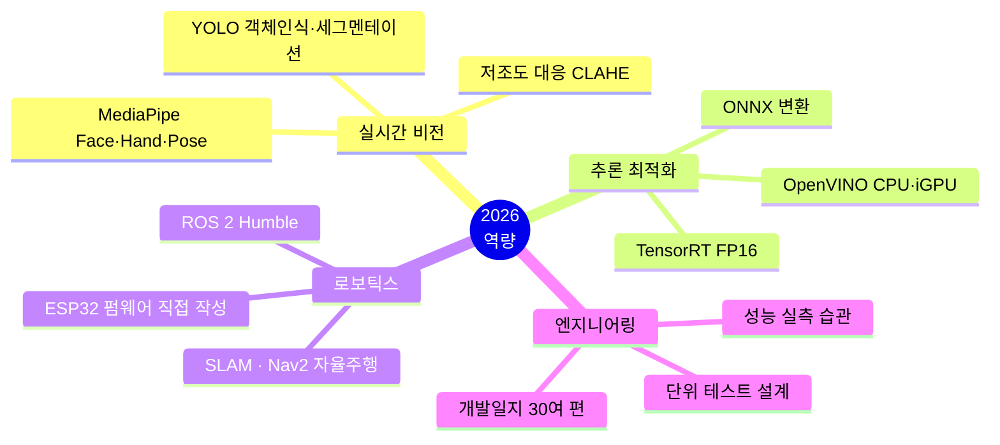

# 2026년 작업

기업 인턴 · 팀 로보틱스 · 캡스톤 · 대회 · 개인 프로젝트

---

가장 비중이 크고 최신인 작업들입니다. **01. 광명테크 인턴**이 대표 프로젝트입니다.

| # | 프로젝트 | 기간 | 형태 | 한 줄 설명 |
|:-:|---|:-:|:-:|---|
| **01** | [**광명테크 인턴 — 배리어프리 키오스크**](01.%20광명테크%20인턴%20-%20배리어프리%20키오스크/) | `07~08월` | **기업 인턴** | 손을 못 쓰는 사용자를 위해 고개·입으로 마우스를 대체합니다. 웹캠 1대만 쓴다 |
| **02** | [**SW파일럿 — TurtleBot3 자율주행 로봇**](02.%20SW파일럿%20-%20TurtleBot3%20자율주행%20로봇/) | `08월` | 팀 | 제스처·장갑 조종 + SLAM 자율 순찰 + 소리 이상감지 |
| **03** | [**캡스톤 — 스마트팩토리 비전검사**](03.%20캡스톤%20-%20스마트팩토리%20비전검사/) | `상반기` | **캡스톤 2단계** | 듀얼 카메라 박스 분류 + TensorRT 가속 + 로봇팔 제어 |
| **04** | [**메디컬 머신러닝 대회**](04.%20메디컬%20머신러닝%20대회/) | `05월` | 대회 | 수술 전 데이터로 ICU 위험도·수술시간을 예측하고 판단 근거를 설명합니다 |
| **05** | [**웹캠 로봇팔 원격조종**](05.%20웹캠%20로봇팔%20원격조종/) | — | 개인 | 센서 없이 웹캠 2D 좌표만으로 6축 로봇팔을 1:1 각도로 제어합니다 |
| **06** | [**웹서버 DB 연동 기초**](06.%20웹서버%20DB%20연동%20기초/) | — | 학습 | 같은 앱을 서버 3종 × DB 2종으로 만들었습니다. 15챕터 교재를 직접 썼다 |

---

## 이 해에 늘어난 역량

---

## 폴더별 상세

<table>
<tr><td width="30%"><b><a href="01.%20광명테크%20인턴%20-%20배리어프리%20키오스크/">01. 광명테크 인턴</a></b></td>
<td>동사무소·법원용 <b>무인 민원발급기</b>를 손을 쓰기 어려운 사용자도 조작할 수 있게 만드는 입력 장치.
헤드트래커(고개+입)와 손 제스처 두 방식이 있습니다. <b>배포 8GB→1.1GB, 렌더 19.8→10.4ms</b> 등
실측으로 개선했습니다. 날짜별 개발일지 30여 편이 함께 있습니다</td></tr>

<tr><td><b><a href="02.%20SW파일럿%20-%20TurtleBot3%20자율주행%20로봇/">02. SW파일럿 로보틱스</a></b></td>
<td>TurtleBot3 + Jetson Orin Nano. 손 제스처·자이로 장갑·조이스틱·자율주행 <b>4가지 조종 방식</b>을
mux로 통합했고, SLAM 지도 기반 순찰과 기어박스 <b>소리 이상감지 + LED 알림</b>,
SO-101 로봇팔 연동까지 다룹니다</td></tr>

<tr><td><b><a href="03.%20캡스톤%20-%20스마트팩토리%20비전검사/">03. 캡스톤</a></b></td>
<td><b>캡스톤 2단계(최종).</b> Jetson에서 <b>카메라 2대를 동시에 추론</b>해 박스를 분류하고 무게 숫자를
읽어 아두이노 로봇팔을 제어합니다. <b>CSI 포트 고장을 USB 듀얼 카메라로 아키텍처를 바꿔 극복</b>했습니다.
1단계는 <a href="../2025/01.%20캡스톤%20-%20라즈베리파이%20선별시스템/">2025년 라즈베리파이</a></td></tr>

<tr><td><b><a href="04.%20메디컬%20머신러닝%20대회/">04. 메디컬 ML 대회</a></b></td>
<td>INSPIRE 의료 데이터로 ICU 입원 위험도(분류)와 수술 시간(회귀)을 동시에 예측합니다.
<b>데이터 누수 차단</b>, <b>SHAP 설명가능 AI</b>, 임상 지식 기반 보정까지 다뤘습니다</td></tr>

<tr><td><b><a href="05.%20웹캠%20로봇팔%20원격조종/">05. 웹캠 로봇팔</a></b></td>
<td>장갑·센서 없이 <b>웹캠 x·y 좌표만으로</b> SO-ARM-101 6축 로봇팔을 조종합니다.
팔꿈치를 90° 굽히면 로봇도 90° 굽도록 <b>실제 각도를 1:1로 매핑</b>했습니다</td></tr>

<tr><td><b><a href="06.%20웹서버%20DB%20연동%20기초/">06. 웹서버 DB 기초</a></b></td>
<td>같은 방명록 앱을 <b>Flask+SQLite / FastAPI+SQLite / Flask+MongoDB</b> 3벌로 만들어
"한 축만 바꾸면 그 축의 역할이 드러난다"는 방식으로 익혔습니다. <b>15챕터 교재를 직접 썼습니다</b></td></tr>
</table>
