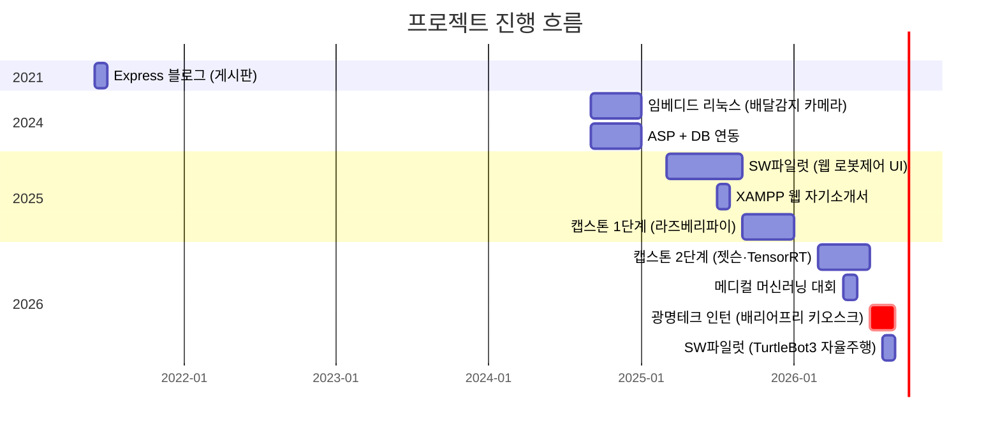
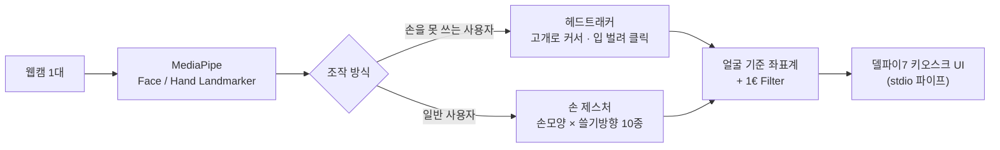
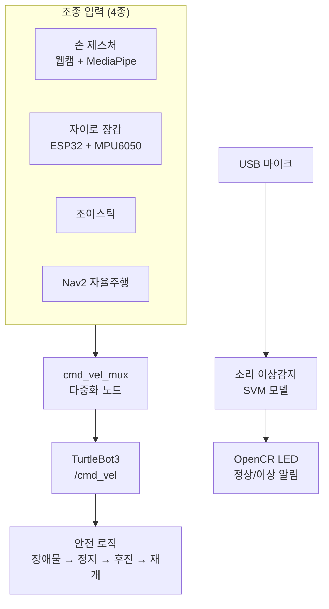

<div align="center">

# 이지용 — 개발 포트폴리오

### 카메라로 사람의 움직임을 읽어 기계를 움직이는 일을 해 왔다

<br>

[](기술_용어집.md#python)
[](기술_용어집.md#cpp)
[](기술_용어집.md#javascript)
[](기술_용어집.md#opencv)
[](기술_용어집.md#ros2)

[](기술_용어집.md#tensorrt)
[](기술_용어집.md#openvino)
[](기술_용어집.md#pytorch)
[](기술_용어집.md#onnx)
[](기술_용어집.md#mediapipe)
[](기술_용어집.md#raspberrypi)
[](기술_용어집.md#arduino)

[](기술_용어집.md#flask)
[](기술_용어집.md#fastapi)
[](기술_용어집.md#nodejs)
[](기술_용어집.md#mongodb)
[](기술_용어집.md#mysql)

</div>

<div align="center">

**배지를 누르면** 그 기술이 무엇이고 어디에 왜 썼는지 볼 수 있다 → [**기술 용어집**](기술_용어집.md)

</div>

---

카메라로 사람의 움직임을 읽어 기계를 움직이는 일을 주로 해 왔다.
손을 쓰기 어려운 분들을 위한 키오스크 입력 장치(기업 인턴), 손짓으로 조종하는
자율주행 로봇(팀 프로젝트), 공장 검사 시스템(캡스톤), 수술 위험도 예측
AI(대회)까지 — 인식부터 판단·제어·화면까지 전 구간을 직접 만들었다.

이 프로젝트들에는 공통점이 하나 있다. **전부 성능이 부족한 하드웨어에서
돌려야 했다는 것이다.** 정부 민원발급기에는 그래픽카드가 없고, 라즈베리파이는
그보다 더 느리다. 그래서 "돌아가게 만드는 것"보다 **"이 환경에서 돌아가게
만드는 것"** 에 훨씬 많은 시간을 썼다.

---

## 일하는 방식

<table>
<tr>
<td width="33%" valign="top">

### 재고 나서 고친다

화면이 자꾸 끊기길래 "다른 프로그램이 CPU를 쓰나 보다" 하고 그에 맞춰
최적화했는데 소용이 없었다. 직접 재보니 **다른 게 다 놀고 있어도 항상
15~16 ms**가 걸리고 있었다. 원인은 윈도우 타이머의 최소 단위였다.

그 뒤로는 고치기 전에 먼저 잰다. 잴 도구가 없으면 만들어서 쓴다.

</td>
<td width="33%" valign="top">

### 막히면 방법을 바꾼다

캡스톤 전시를 앞두고 **카메라 포트가 물리적으로 고장** 났다. 설계를 통째로
바꿔 USB 카메라 두 대 구성으로 다시 만들었고, 전시는 예정대로 마쳤다.

키오스크에서 뒷사람이 같이 인식되던 문제도 접근법을 다섯 번 바꿔가며 풀었다.

</td>
<td width="33%" valign="top">

### 남이 볼 수 있게 남긴다

날짜별 개발일지 30여 편, 오류 모음, 참고 논문 정리를 함께 썼다.
잘된 것만이 아니라 **실패한 시도와 되돌린 결정도 그대로** 적었다.

적용한 기법은 어느 논문에서 온 것인지 밝혔다.

</td>
</tr>
</table>

---

## 판단이 필요했던 순간

기술을 아는 것만큼이나 **무엇을 고르고 무엇을 버릴지**가 중요했던 일들이다.

| 상황 | 어떻게 판단했나 |
|---|---|
| **성능은 좋은데 라이선스가 걸렸다** | 쓰고 있던 라이브러리가 AGPL이었다. 그대로 두면 회사 제품 소스까지 공개해야 할 수 있어서, 성능이 조금 아쉬워도 **상업적으로 안전한 쪽(Apache-2.0)으로 전부 교체**했다. 기술 선택이 성능이 아니라 법으로 결정된 경우다 |
| **감으로 두 번 고쳤다가 더 나빠졌다** | 커서가 휘는 문제를 어림값으로 두 번 손봤는데 오히려 심해졌다. 세 번째엔 추측을 멈추고 **곡률을 재는 도구부터 만들었다.** 그 과정에서 진짜 원인(계산식이 화면 끝에서 발산하는 버그)을 찾았고, 같은 실수가 반복되지 않게 테스트를 남겼다 |
| **같은 버그에 네 번 걸렸다** | 한글 콘솔에서 특정 문자가 프로그램을 죽이는 문제를 **매번 그 파일에서만** 고쳤더니, 새 파일을 만들 때마다 되살아났다. 네 번째에야 공용 함수로 옮기고 **테스트가 대신 기억하게** 만들었다 |

---

## 저장소 구조

연도별로 나눴다. 위에서부터 최신 작업이다.

```
My_project
├── 2026/                    ← 최신 · 비중이 가장 큰 작업들
│   ├── 01. 광명테크 인턴 - 배리어프리 키오스크   ★ 기업 인턴
│   ├── 02. SW파일럿 - TurtleBot3 자율주행 로봇     팀 프로젝트
│   ├── 03. 캡스톤 - 스마트팩토리 비전검사          캡스톤
│   ├── 04. 메디컬 머신러닝 대회                    대회
│   ├── 05. 웹캠 로봇팔 원격조종                    개인
│   └── 06. 웹서버 DB 연동 기초                     학습교재 집필
├── 2025/
│   ├── 01. 캡스톤 - 라즈베리파이 선별시스템
│   └── 02. SW파일럿 - 웹 로봇제어 UI
├── 2024/
│   ├── 01. 임베디드 리눅스 - 배달감지 카메라
│   └── 02. ASP + DB 연동
├── 2021/
│   └── 01. Express 블로그 - 게시판      ← 가장 오래된 작업
└── 개인 프로젝트/            ← 시기를 특정하기 어려운 것들
    ├── 고클린 - 윈도우 최적화 도구
    └── [외부코드] 마인크래프트 falling-pickaxe
```

---

## 프로젝트 타임라인



---

## 프로젝트 한눈에 보기

| # | 프로젝트 | 기간 | 형태 | 한 줄 설명 | 핵심 기술 |
|:-:|---|:-:|:-:|---|---|
| **1** | **[배리어프리 키오스크 입력 장치](2026/01.%20광명테크%20인턴%20-%20배리어프리%20키오스크/)** | `2026.07~08` | **기업 인턴** | 손을 못 쓰는 사용자를 위해 **고개·입 움직임으로 마우스를 대체**한다. 웹캠 1대만 쓴다 | `MediaPipe` `OpenVINO` `OpenCV` `델파이7` |
| **2** | **[TurtleBot3 자율주행 로봇](2026/02.%20SW파일럿%20-%20TurtleBot3%20자율주행%20로봇/)** | `2026.08` | 팀 | 손 제스처·자이로 장갑 조종 + **SLAM 지도 기반 자율 순찰** + 소리 이상감지 | `ROS 2` `Nav2/SLAM` `Jetson` `ESP32` |
| **3** | **[스마트팩토리 비전 검사](2026/03.%20캡스톤%20-%20스마트팩토리%20비전검사/)** | `2026.상반기` | **캡스톤 2단계** | 듀얼 카메라로 박스를 분류·검사하고 로봇팔을 제어한다. **캡스톤 2단계 · TensorRT 가속** | `YOLO` `TensorRT` `FastAPI` `Jetson` |
| **4** | **[수술 위험도 예측 AI](2026/04.%20메디컬%20머신러닝%20대회/)** | `2026.05` | 대회 | 수술 **전** 데이터만으로 ICU 위험도·수술시간을 예측하고 **판단 근거까지 설명**한다 | `LightGBM` `XGBoost` `SHAP` `Flask` |
| **5** | **[웹캠 로봇팔 원격조종](2026/05.%20웹캠%20로봇팔%20원격조종/)** | `2026` | 개인 | 센서 없이 **웹캠 2D 좌표만으로** 6축 로봇팔을 1:1 각도로 제어한다 | `MediaPipe` `lerobot` `1€ Filter` |
| **6** | **[웹서버+DB 학습 교재](2026/06.%20웹서버%20DB%20연동%20기초/)** | `2026` | 학습 | 같은 앱을 **서버 3종 × DB 2종**으로 만들어 차이를 정리했다. **15챕터 직접 집필** | `Flask` `FastAPI` `SQLite` `MongoDB` |
| **7** | **[라즈베리파이 선별 시스템](2025/01.%20캡스톤%20-%20라즈베리파이%20선별시스템/)** | `2025.2학기` | **캡스톤 1단계** | YOLO로 크기·불량을 판정해 아두이노 분류기를 제어한다. **캡스톤 1단계** | `YOLOv8-seg` `ONNX` `Flask` `Arduino` |
| **8** | **[윈도우 최적화 도구 '고클린'](개인%20프로젝트/고클린%20-%20윈도우%20최적화%20도구/)** | `개인` | 개인 | PC 청소·게임모드·진단을 한 번에. **exe로 빌드해 배포** | `Python` `tkinter` `PyInstaller` |

---

## 기술 스택

<table>
<tr><td width="20%"><b>언어</b></td><td>

`Python`(주력) · `C/C++`(Arduino·ESP32) · `JavaScript` · `HTML/CSS` · `SQL`

</td></tr>
<tr><td><b>비전 · AI</b></td><td>

`MediaPipe`(Hand/Face/Pose Landmarker) · `YOLOv8` / `YOLOv8-seg` · `OpenCV`
`LightGBM` · `XGBoost` · `SHAP`(설명가능 AI)

</td></tr>
<tr><td><b>추론 최적화</b></td><td>

[`PyTorch`](기술_용어집.md#pytorch) · [`ONNX Runtime`](기술_용어집.md#onnx) · [`TensorRT`](기술_용어집.md#tensorrt)(FP16 양자화) · [`OpenVINO`](기술_용어집.md#openvino)

학습은 PyTorch, 배포는 ONNX/TensorRT/OpenVINO로 변환해서 쓴다

</td></tr>
<tr><td><b>로보틱스</b></td><td>

`ROS 2 Humble` · `Nav2` · `SLAM Toolbox` · `TurtleBot3` · `DynamixelSDK` · `lerobot`

</td></tr>
<tr><td><b>하드웨어</b></td><td>

`Jetson Orin Nano` · `Raspberry Pi` · `Arduino` · `ESP32`(MPU6050) · `OpenCR` · `Intel RealSense`

</td></tr>
<tr><td><b>백엔드 · 웹</b></td><td>

`Flask` · `FastAPI` · `Express`(Node.js) · `ASP` · `MySQL` · `SQLite` · `MongoDB`

</td></tr>
<tr><td><b>기타</b></td><td>

`Git` · `PyInstaller` · 델파이7 연동(stdio 파이프) · `Chart.js`

</td></tr>
</table>

---

## 대표 프로젝트 ① — 배리어프리 키오스크 입력 장치

> (주)광명테크 인턴 · `2026.07 ~ 08` · [폴더 바로가기](2026/01.%20광명테크%20인턴%20-%20배리어프리%20키오스크/)

동사무소·법원에 놓이는 무인 민원발급기를, 손을 쓰기 어려운 사용자도 조작할 수 있게
만드는 입력 장치다. **일반 웹캠 1대만** 쓰고 별도 센서는 없다.



### 수치로 본 결과

| 항목 | 이전 | 이후 | 개선 |
|---|:-:|:-:|:-:|
| 배포 용량 | 8 GB | **1.1 GB** | 86% 감소 |
| 화면 1프레임 렌더링 | 19.8 ms | **10.4 ms** | 47% 단축 |
| 몸이 움직일 때 커서 오차 | 밀려감 | **0 px** | 원리적 해결 |
| 입 벌릴 때 커서 오차 | 밀려남 | **0.00 px** | 해결 |
| 드래그 중 커서 떨림 | 2.05 px | **0.78 px** | 62% 감소 |
| 카메라 고장 시 | 조용히 정지 | **4초 내 자동 복구** | — |
| 오류 40초치 로그량 | 약 1,200줄 | **2줄** | 99% 감소 |
| 렌더 프레임 | 30 fps | **60 fps** | 2배 |

<details>
<summary><b>대표 문제 해결 3건 — 펼쳐보기</b></summary>

<br>

### 1. 깊이 센서 없이 "조작하는 사람"만 구별하기

배리어프리 키오스크는 동사무소처럼 **줄을 서는 공공장소**에 놓인다.
일반 RGB 카메라만 쓰는 구조라 거리 정보가 없어, 뒤나 옆에 있는 사람의 손이 같이
인식되며 조작권이 수시로 넘어갔다.

별도 센서 추가 없이 소프트웨어만으로 해결해야 했다. 앵커 고정 → 크기 기반 거리 추정
→ 팔 길이 제약 조건 → **주변 배경을 흐리게 처리해 인식 모델 자체가 다른 사람을 보지
못하게 하는 방식**까지 다섯 단계를 순차적으로 시도하며 발상을 전환했다. 동시에 일반
카메라로 실시간 깊이를 추정하는 사이드 프로젝트(MiDaS)를 별도로 구현해 근본적인 대안
가능성까지 검증했다.

실사용 수준까지 해결했고, 그 과정과 대안을 **회사 보고서로 정리해 제출**했다.

---

### 2. 측정 없이는 답을 알 수 없다 — 두 번의 성능 오판

화면이 자꾸 끊겼고, *"다른 프로그램이 CPU를 쓸 때만 느려진다"* 는 그럴듯한 가설을
세워 그에 맞춰 최적화했다. **그런데 해결되지 않았다.**

가설 자체를 의심하고 지연 시간을 항목별로 직접 측정했다. 그 결과
*"다른 스레드가 쉬고 있어도 **항상** 15~16 ms가 걸린다"* 는, 처음 가설과 완전히 다른
패턴이 나왔다. 원인을 추적한 끝에 **윈도우 기본 타이머의 최소 단위(15.6 ms)가
병목**이라는 걸 확인하고 대기 방식 자체를 바꿔 해결했다. 같은 방식으로
*"해상도를 낮추면 빨라진다"* 는 이전 결정도 재검증해 **실제로는 이득이 0이었다**는
것도 밝혀냈다.

19.8 ms → **10.4 ms**. 이후로는 어떤 최적화든 적용 전후를 반드시 실측한다.

---

### 3. 어림값 대신 측정 도구를 만들어 해결

커서가 좌우로 움직일 때 포물선으로 휘는 문제를 **어림값으로 두 번 고치려다 오히려
악화**시켰다.

세 번째 추측을 하는 대신, 곡률을 실제로 재는 도구(`measure_arc.py`)를 만들어
**2차 회귀분석**으로 계수를 뽑았다. 그 과정에서 **보정식이 화면 끝을 넘어가면 발산하는
진짜 버그**를 발견했다(클램프 전 값을 제곱해서 쓰고 있었다).

근본 원인을 수정하고 **회귀 테스트를 남겨** 같은 버그가 재발하지 않게 했다.

</details>

<details>
<summary><b>적용 기술의 출처 — 펼쳐보기</b></summary>

<br>

논문·표준을 인용해 적용하고, 코드 주석과 문서에 출처를 남겼다.

| 기법 | 출처 | 어디에 썼나 |
|---|---|---|
| **1€ Filter** | Casiez, Roussel, Vogel — *ACM CHI 2012* | 커서 떨림 제거 (속도 적응형) |
| **CLAHE** | Zuiderveld — *Graphics Gems IV, 1994* | 저조도 환경 인식률 개선 |
| **ISO 9241-411:2012** | 국제 표준 | 포인팅 장치 처리량 측정 |
| **중앙값 캘리브레이션** | 로버스트 통계 기본 기법 | 눈 깜빡임 등 이상치 제거 |
| **히스테리시스 + 쿨다운** | 제어·신호처리 기본 기법 | 입 벌림·눈 감김 판정 오발 방지 |
| **MiDaS** | Ranftl et al. — Intel ISL | 단안 깊이 추정 (대안 검증용) |

</details>

---

## 대표 프로젝트 ② — TurtleBot3 자율주행 로봇

> SW 파일럿 로보틱스 1팀 · `2026.08` · `Ubuntu 22.04 / ROS 2 Humble / Jetson Orin Nano`
> [폴더 바로가기](2026/02.%20SW파일럿%20-%20TurtleBot3%20자율주행%20로봇/)

TurtleBot3를 **네 가지 방식으로 조종**하고, 지도 기반으로 **스스로 순찰**하며,
**기계 소리로 이상을 감지**해 LED로 알리는 통합 로봇 시스템이다.



| 기능 | 구현 내용 |
|---|---|
| **손 제스처 조종** | 웹캠 → MediaPipe → 손끝 위치를 D-pad 방향으로 매핑 → `/cmd_vel` 발행 |
| **자이로 장갑** | ESP32 + MPU6050 펌웨어를 직접 작성하고, Wi-Fi로 기울기를 전송한다 |
| **다중 입력 조정** | 여러 조종 입력 중 하나만 로봇에 전달하는 mux 노드를 설계했다 |
| **자율 순찰** | SLAM으로 공장 지도를 만들고 Nav2로 A→B→C→D→A 웨이포인트를 순찰한다 |
| **안전 로직** | 자율주행 중 장애물을 감지하면 정지 → 후진 → 재개하는 상태 머신 |
| **소리 이상감지** | USB 마이크로 기어박스 소리를 듣고 SVM 모델로 이상을 판정해 LED로 알린다 |
| **로봇팔 연동** | SO-101 6축 로봇팔을 사람 팔 동작으로 원격조종한다 |

★ **하드웨어 없이도 검증되게** 만들었다 — 손 모양 판별, D-pad 매핑, mux 로직,
웨이포인트 도착 판정, LED 상태 머신을 GPIO 접근부와 분리해 단위 테스트로 검증한다.

---

## 더 보기

<div align="center">

| [**2026년**](2026/) | [**2025년**](2025/) | [**2024년**](2024/) | [**2021년**](2021/) | [**개인 프로젝트**](개인%20프로젝트/) |
|:-:|:-:|:-:|:-:|:-:|
| 인턴 · 로보틱스<br>캡스톤 · 대회 | 라즈베리파이 선별<br>웹 로봇제어 · XAMPP | 임베디드 리눅스<br>ASP DB 연동 | Express<br>블로그 | 고클린<br>외부코드 |

</div>

---

### 저장소 안내

설치하면 생기는 파일(가상환경 · `node_modules` · 빌드 산출물 · 다운로드한 모델
가중치)은 용량과 재현성을 고려해 제외했다. 각 프로젝트의 `requirements.txt`로
복원된다. 무엇이 빠져 있고 어떻게 되살리는지는 **[실행 가이드](실행_가이드.md)** 에
표로 정리해 두었다.

ROS 2 표준 패키지(`turtlebot3`, `DynamixelSDK` 등)와 `lerobot`은
**ROBOTIS·HuggingFace의 공식 오픈소스**이며, 실행에 필요해 함께 보관한 것이다.
직접 작성한 부분은 각 폴더의 README에 별도로 표시했다.
