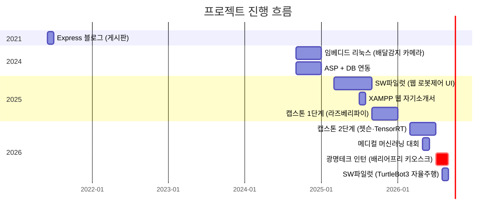
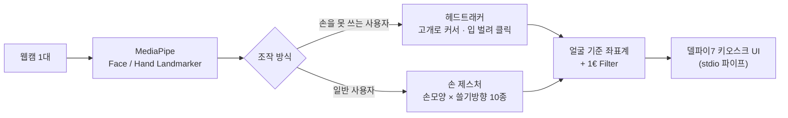
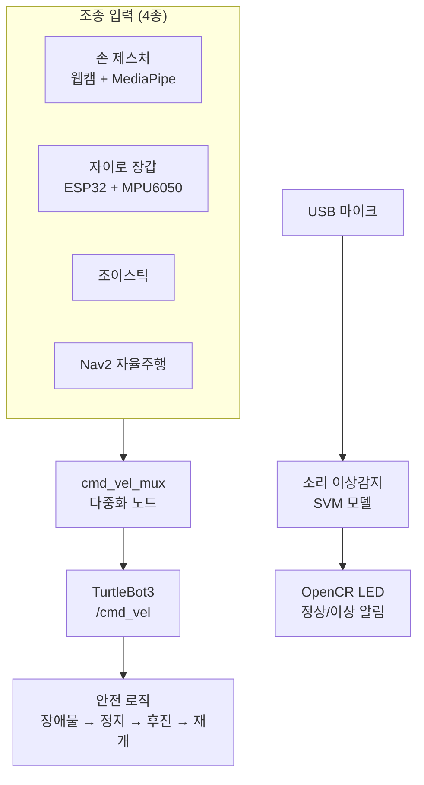

<div align="center">

# 이지용 — 개발 포트폴리오

### 카메라로 사람의 움직임을 읽어 기계를 움직이는 일을 해 왔습니다

<br>

[](기술_용어집.md#python)
[](기술_용어집.md#cpp)
[](기술_용어집.md#javascript)
[](기술_용어집.md#opencv)
[](기술_용어집.md#ros2)

[](기술_용어집.md#tensorrt)
[](기술_용어집.md#openvino)
[](기술_용어집.md#pytorch)
[](기술_용어집.md#onnx)
[](기술_용어집.md#mediapipe)
[](기술_용어집.md#raspberrypi)
[](기술_용어집.md#arduino)

[](기술_용어집.md#flask)
[](기술_용어집.md#fastapi)
[](기술_용어집.md#nodejs)
[](기술_용어집.md#mongodb)
[](기술_용어집.md#mysql)

</div>

<div align="center">

배지를 누르면 그 기술을 어디에 왜 썼는지 볼 수 있습니다 → [**기술 용어집**](기술_용어집.md)

</div>

---

웹캠으로 사람의 손이나 얼굴을 읽어서 기계를 움직이는 쪽 일을 주로 했습니다.
키오스크 입력 장치, 자율주행 로봇, 비전 검사 설비 같은 것들입니다.

## 무엇을 만들었나

| 무엇을 | 어떤 문제를 풀었나 | 언제 · 어떤 형태로 |
|---|---|:-:|
| **[배리어프리 키오스크 입력 장치](2026/01.%20광명테크%20인턴%20-%20배리어프리%20키오스크/)** | 손을 쓰기 어려운 분이 **고개와 입만으로 민원발급기를 조작**할 수 있게 했습니다. 웹캠 한 대만 씁니다 | `2026.07~08`<br>**기업 인턴** |
| **[자율주행 로봇](2026/02.%20SW파일럿%20-%20TurtleBot3%20자율주행%20로봇/)** | 손짓·자이로 장갑으로 로봇을 조종하고, 지도를 만들어 **스스로 순찰**하게 했습니다. 기계 소리로 고장도 감지합니다 | `2026.08`<br>팀 프로젝트 |
| **[스마트팩토리 비전 검사](2026/03.%20캡스톤%20-%20스마트팩토리%20비전검사/)** | 카메라 두 대로 박스를 분류하고 무게 숫자를 읽어 **로봇팔을 제어**합니다 | `2026 상반기`<br>캡스톤 2단계 |
| **[수술 위험도 예측 AI](2026/04.%20메디컬%20머신러닝%20대회/)** | 수술 **전** 데이터만으로 중환자실 입원 위험과 수술 시간을 예측하고, **왜 그렇게 판단했는지까지** 의료진에게 설명합니다 | `2026.05`<br>대회 |
| **[웹캠 로봇팔 원격조종](2026/05.%20웹캠%20로봇팔%20원격조종/)** | 센서나 장갑 없이 **웹캠만으로** 사람 팔을 따라 하는 6축 로봇팔을 만들었습니다 | `2026`<br>개인 |
| **[웹서버 + DB 교재](2026/06.%20웹서버%20DB%20연동%20기초/)** | 같은 앱을 **서버 3종 × DB 2종**으로 만들어 차이를 정리하고, **15챕터 교재를 직접 썼습니다** | `2026`<br>학습 |
| **[라즈베리파이 선별 시스템](2025/01.%20캡스톤%20-%20라즈베리파이%20선별시스템/)** | 물체의 크기와 불량 여부를 판정해 **아두이노 분류기를 제어**합니다 | `2025 2학기`<br>캡스톤 1단계 |
| **[윈도우 최적화 도구](개인%20프로젝트/고클린%20-%20윈도우%20최적화%20도구/)** | PC 청소·게임모드·진단을 한 화면에 모아 **실행파일로 배포**했습니다 | 개인 도구 |

목록을 늘어놓고 보니 공통점이 하나 보입니다. **전부 성능이 모자란 기계 위에서
돌려야 했습니다.** 민원발급기에는 그래픽카드가 없고, 라즈베리파이는 그보다도
느립니다. 그래서 "돌아가게 만드는 일"보다 **"이 하드웨어에서 돌아가게 만드는 일"**
에 훨씬 오래 매달렸습니다.

---

## 일하면서 지킨 것

**고치기 전에 측정합니다.** 화면이 끊기길래 원인을 짐작해서 최적화한 적이 있는데
아무 소용이 없었습니다. 나중에 직접 측정해 보니 엉뚱한 데가 병목이었습니다.
그 뒤로는 순서를 바꿨습니다. 측정할 도구가 없으면 도구부터 만듭니다.

**막히면 방법을 바꿉니다.** 전시를 며칠 앞두고 카메라 포트가 고장 났을 때는
설계를 통째로 갈아엎고 다른 구성으로 다시 만들어서 일정을 맞췄습니다.

**남이 볼 수 있게 남깁니다.** 개발일지를 30편 넘게 썼고 오류 모음도 따로
정리했습니다. 잘된 것만 적으면 나중에 쓸모가 없어서, 실패한 시도와 되돌린
결정도 같이 적었습니다.

---

## 기억에 남는 판단

**성능보다 라이선스를 택했습니다.** 쓰던 라이브러리가 AGPL이었습니다. 그대로
두면 회사 제품 소스까지 공개해야 할 수 있어서, 아쉬웠지만 안전한 쪽으로 전부
바꿨습니다.

**감으로 고치다 멈추고 도구를 만들었습니다.** 커서가 휘는 문제를 어림값으로 두 번
손봤는데 오히려 나빠졌습니다. 세 번째에는 추측을 접고 곡률을 측정하는 도구부터
만들었고, 거기서 진짜 원인이 나왔습니다.

---

## 저장소 구조

연도별로 나눴습니다. 위에서부터 최신 작업입니다.

```
My_project
├── 2026/                    ← 최신 · 비중이 가장 큰 작업들
│   ├── 01. 광명테크 인턴 - 배리어프리 키오스크   ★ 기업 인턴
│   ├── 02. SW파일럿 - TurtleBot3 자율주행 로봇     팀 프로젝트
│   ├── 03. 캡스톤 - 스마트팩토리 비전검사          캡스톤
│   ├── 04. 메디컬 머신러닝 대회                    대회
│   ├── 05. 웹캠 로봇팔 원격조종                    개인
│   └── 06. 웹서버 DB 연동 기초                     학습교재 집필
├── 2025/
│   ├── 01. 캡스톤 - 라즈베리파이 선별시스템
│   └── 02. SW파일럿 - 웹 로봇제어 UI
├── 2024/
│   ├── 01. 임베디드 리눅스 - 배달감지 카메라
│   └── 02. ASP + DB 연동
├── 2021/
│   └── 01. Express 블로그 - 게시판      ← 가장 오래된 작업
└── 개인 프로젝트/            ← 시기를 특정하기 어려운 것들
    ├── 고클린 - 윈도우 최적화 도구
    └── [외부코드] 마인크래프트 falling-pickaxe
```

---

## 프로젝트 타임라인



---

## 기술 스택

<table>
<tr><td width="20%"><b>언어</b></td><td>

`Python`(주력) · `C/C++`(Arduino·ESP32) · `JavaScript` · `HTML/CSS` · `SQL`

</td></tr>
<tr><td><b>비전 · AI</b></td><td>

`MediaPipe`(Hand/Face/Pose Landmarker) · `YOLOv8` / `YOLOv8-seg` · `OpenCV`
`LightGBM` · `XGBoost` · `SHAP`(설명가능 AI)

</td></tr>
<tr><td><b>추론 최적화</b></td><td>

[`PyTorch`](기술_용어집.md#pytorch) · [`ONNX Runtime`](기술_용어집.md#onnx) · [`TensorRT`](기술_용어집.md#tensorrt)(FP16 양자화) · [`OpenVINO`](기술_용어집.md#openvino)

학습은 PyTorch로 하고, 배포할 때 ONNX·TensorRT·OpenVINO로 바꿔서 씁니다

</td></tr>
<tr><td><b>로보틱스</b></td><td>

`ROS 2 Humble` · `Nav2` · `SLAM Toolbox` · `TurtleBot3` · `DynamixelSDK` · `lerobot`

</td></tr>
<tr><td><b>하드웨어</b></td><td>

`Jetson Orin Nano` · `Raspberry Pi` · `Arduino` · `ESP32`(MPU6050) · `OpenCR` · `Intel RealSense`

</td></tr>
<tr><td><b>백엔드 · 웹</b></td><td>

`Flask` · `FastAPI` · `Express`(Node.js) · `ASP` · `MySQL` · `SQLite` · `MongoDB`

</td></tr>
<tr><td><b>기타</b></td><td>

`Git` · `PyInstaller` · 델파이7 연동(stdio 파이프) · `Chart.js`

</td></tr>
</table>

---

## 대표 프로젝트 ① — 배리어프리 키오스크 입력 장치

> (주)광명테크 인턴 · `2026.07 ~ 08` · [폴더 바로가기](2026/01.%20광명테크%20인턴%20-%20배리어프리%20키오스크/)

동사무소나 법원에 놓이는 무인 민원발급기를, 손을 쓰기 어려운 사용자도 조작할 수
있게 만드는 입력 장치입니다. **일반 웹캠 한 대만** 쓰고 별도 센서는 달지 않습니다.



### 수치로 본 결과

| 항목 | 이전 | 이후 | 개선 |
|---|:-:|:-:|:-:|
| 배포 용량 | 8 GB | **1.1 GB** | 86% 감소 |
| 화면 1프레임 렌더링 | 19.8 ms | **10.4 ms** | 47% 단축 |
| 몸이 움직일 때 커서 오차 | 밀려감 | **0 px** | 원리적 해결 |
| 입 벌릴 때 커서 오차 | 밀려남 | **0.00 px** | 해결 |
| 드래그 중 커서 떨림 | 2.05 px | **0.78 px** | 62% 감소 |
| 카메라 고장 시 | 조용히 정지 | **4초 내 자동 복구** | — |
| 오류 40초치 로그량 | 약 1,200줄 | **2줄** | 99% 감소 |
| 렌더 프레임 | 30 fps | **60 fps** | 2배 |

<details>
<summary><b>대표 문제 해결 3건 — 펼쳐보기</b></summary>

<br>

### 1. 깊이 센서 없이 "조작하는 사람"만 구별하기

이 키오스크는 동사무소처럼 **줄을 서는 곳**에 놓입니다. 일반 RGB 카메라만 쓰니
거리 정보가 없어서, 뒤나 옆에 선 사람의 손이 같이 잡히고 조작권이 수시로
넘어갔습니다.

센서를 더 달지 않고 소프트웨어만으로 풀어야 했습니다. 앵커 고정, 크기로 거리
추정, 팔 길이 제약을 차례로 시도했고, 마지막에는 **주변 배경을 흐리게 만들어
인식 모델이 다른 사람을 아예 보지 못하게** 하는 데까지 갔습니다. 다섯 단계를
거치면서 접근을 계속 바꿨습니다. 그와 별개로 일반 카메라로 실시간 깊이를
추정하는 사이드 프로젝트(MiDaS)도 만들어, 근본적인 대안이 되는지까지 확인했습니다.

실사용 수준까지 해결했고, 그 과정과 대안을 **회사 보고서로 정리해 제출**했습니다.

---

### 2. 측정하지 않으면 알 수 없다 — 두 번의 성능 오판

화면이 자꾸 끊겼습니다. *"다른 프로그램이 CPU를 쓸 때만 느려진다"* 는 그럴듯한
가설을 세우고 거기에 맞춰 최적화했는데, **해결되지 않았습니다.**

가설 자체를 의심하고 지연 시간을 항목별로 측정했습니다. 그랬더니
*"다른 스레드가 놀고 있어도 **항상** 15~16 ms가 걸린다"* 는, 처음 생각과 전혀
다른 모양이 나왔습니다. 추적해 보니 **윈도우 기본 타이머의 최소 단위(15.6 ms)가
병목**이었습니다. 대기 방식을 바꿔서 해결했습니다. 같은 방법으로
*"해상도를 낮추면 빨라진다"* 던 이전 결정도 다시 측정했는데, **이득이 0**이었습니다.

19.8 ms → **10.4 ms**. 그 뒤로는 어떤 최적화든 적용 전후를 반드시 측정합니다.

---

### 3. 어림값 대신 측정 도구를 만들어 해결

커서가 좌우로 움직일 때 포물선처럼 휘었습니다. 어림값으로 두 번 고쳐 봤는데
**두 번 다 더 나빠졌습니다.**

세 번째에는 추측을 그만두고 곡률을 실제로 측정하는 도구(`measure_arc.py`)를
만들어 **2차 회귀분석**으로 계수를 뽑았습니다. 그 과정에서 **보정식이 화면 끝을
넘어가면 발산하는 진짜 버그**가 나왔습니다. 클램프하기 전 값을 제곱해서 쓰고
있었습니다.

근본 원인을 고치고 **회귀 테스트를 남겨** 같은 버그가 다시 나지 않게 했습니다.

</details>

<details>
<summary><b>적용 기술의 출처 — 펼쳐보기</b></summary>

<br>

논문과 표준을 인용해서 적용하고, 코드 주석과 문서에 출처를 남겼습니다.

| 기법 | 출처 | 어디에 썼나 |
|---|---|---|
| **1€ Filter** | Casiez, Roussel, Vogel — *ACM CHI 2012* | 커서 떨림 제거 (속도 적응형) |
| **CLAHE** | Zuiderveld — *Graphics Gems IV, 1994* | 저조도 환경 인식률 개선 |
| **ISO 9241-411:2012** | 국제 표준 | 포인팅 장치 처리량 측정 |
| **중앙값 캘리브레이션** | 로버스트 통계 기본 기법 | 눈 깜빡임 등 이상치 제거 |
| **히스테리시스 + 쿨다운** | 제어·신호처리 기본 기법 | 입 벌림·눈 감김 판정 오발 방지 |
| **MiDaS** | Ranftl et al. — Intel ISL | 단안 깊이 추정 (대안 검증용) |

</details>

---

## 대표 프로젝트 ② — TurtleBot3 자율주행 로봇

> SW 파일럿 로보틱스 1팀 · `2026.08` · `Ubuntu 22.04 / ROS 2 Humble / Jetson Orin Nano`
> [폴더 바로가기](2026/02.%20SW파일럿%20-%20TurtleBot3%20자율주행%20로봇/)

TurtleBot3를 **네 가지 방식으로 조종**할 수 있게 하고, 지도를 만들어 **스스로
순찰**하게 했습니다. 기계 소리를 듣고 이상이 있으면 LED로 알립니다.



| 기능 | 구현 내용 |
|---|---|
| **손 제스처 조종** | 웹캠 → MediaPipe → 손끝 위치를 D-pad 방향으로 매핑 → `/cmd_vel` 발행 |
| **자이로 장갑** | ESP32 + MPU6050 펌웨어를 직접 작성하고, Wi-Fi로 기울기를 전송합니다 |
| **다중 입력 조정** | 여러 조종 입력 중 하나만 로봇에 전달하는 mux 노드를 설계했습니다 |
| **자율 순찰** | SLAM으로 공장 지도를 만들고 Nav2로 A→B→C→D→A 웨이포인트를 순찰합니다 |
| **안전 로직** | 자율주행 중 장애물을 감지하면 정지 → 후진 → 재개하는 상태 머신 |
| **소리 이상감지** | USB 마이크로 기어박스 소리를 듣고 SVM 모델로 이상을 판정해 LED로 알립니다 |
| **로봇팔 연동** | SO-101 6축 로봇팔을 사람 팔 동작으로 원격조종합니다 |

로봇이 없어도 검증되게 만든 부분이 있습니다. 손 모양 판별, D-pad 매핑, mux 로직,
웨이포인트 도착 판정, LED 상태 머신을 GPIO 접근부와 떼어 놓아서 단위 테스트로
확인합니다.

---

## 더 보기

<div align="center">

| [**2026년**](2026/) | [**2025년**](2025/) | [**2024년**](2024/) | [**2021년**](2021/) | [**개인 프로젝트**](개인%20프로젝트/) |
|:-:|:-:|:-:|:-:|:-:|
| 인턴 · 로보틱스<br>캡스톤 · 대회 | 라즈베리파이 선별<br>웹 로봇제어 · XAMPP | 임베디드 리눅스<br>ASP DB 연동 | Express<br>블로그 | 고클린<br>외부코드 |

</div>

---

### 저장소 안내

설치하면 다시 생기는 파일(가상환경, `node_modules`, 빌드 산출물, 내려받은 모델
가중치)은 넣지 않았습니다. 용량만 커지고 기기마다 어차피 새로 만들어야 하기
때문입니다. 각 프로젝트의 `requirements.txt`로 복원됩니다. 무엇이 빠져 있고
어떻게 되살리는지는 **[실행 가이드](실행_가이드.md)** 에 표로 정리해 뒀습니다.

ROS 2 표준 패키지(`turtlebot3`, `DynamixelSDK` 등)와 `lerobot`은 ROBOTIS와
HuggingFace의 공식 오픈소스입니다. 실행에 필요해서 같이 보관한 것이고, 제가
직접 쓴 부분은 각 폴더 README에 따로 표시해 뒀습니다.
