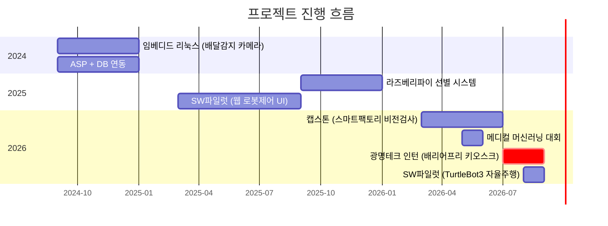
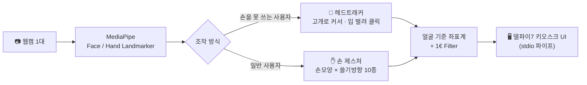
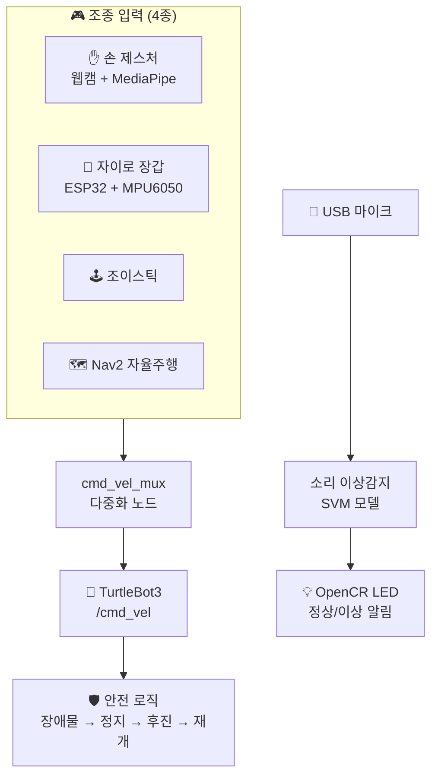

<div align="center">

# 🤖 이지용 · 개발 포트폴리오

### 카메라로 사람의 움직임을 읽어 기계를 움직입니다

<br>


<br>

> **배리어프리 키오스크 입력 장치**(기업 인턴) · **자율주행 로봇**(팀 프로젝트)
> **스마트팩토리 비전 검사**(캡스톤) · **의료 AI 예측 모델**(대회)
>
> **인식 → 판단 → 제어 → 화면**의 전 구간을 직접 만들어 봤습니다.

</div>

---

## 👋 저를 한 문장으로

> **개발 PC에서만 되는 코드가 아니라, 제약이 있는 실제 하드웨어에서 끝까지 돌아가게 만듭니다.**

그래픽카드 없는 키오스크 · 젯슨 보드 · 라즈베리파이처럼 자원이 부족한 환경에서
**성능을 직접 실측**하고, 문제의 원인을 끝까지 추적해 **현장에 배포**한 경험이 있습니다.

<table>
<tr>
<td width="33%" align="center">

### 📏 측정하고 고칩니다

추측으로 고치지 않습니다.
성능 가설이 틀렸다는 걸
**실측으로 발견**하고,
없으면 **측정 도구를 만들어** 씁니다.

</td>
<td width="33%" align="center">

### 🔧 하드웨어까지 갑니다

카메라·시리얼·GPIO·펌웨어까지
직접 다룹니다. 부품이 고장 나면
**아키텍처를 바꿔서라도** 끝냅니다.

</td>
<td width="33%" align="center">

### 📝 기록을 남깁니다

날짜별 개발일지 **30여 편**,
오류 모음, 참고 논문 정리.
적용한 기법은 **출처를 밝힙니다.**

</td>
</tr>
</table>

---

## 🗂️ 저장소 구조

```
📦 My_project
├── 📁 2026/                    ← 최신 · 가장 비중 큰 작업들
│   ├── 01. 광명테크 인턴 - 배리어프리 키오스크   ⭐ 기업 인턴
│   ├── 02. SW파일럿 - TurtleBot3 자율주행 로봇   🤖 팀 프로젝트
│   ├── 03. 캡스톤 - 스마트팩토리 비전검사        🏭 캡스톤
│   ├── 04. 메디컬 머신러닝 대회                  🏥 대회
│   ├── 05. 웹캠 로봇팔 원격조종                  🦾 개인
│   └── 06. 웹서버 DB 연동 기초                   📚 학습교재 집필
├── 📁 2025/
│   ├── 01. 라즈베리파이 선별 시스템
│   └── 02. SW파일럿 - 웹 로봇제어 UI
├── 📁 2024/
│   ├── 01. 임베디드 리눅스 - 배달감지 카메라
│   └── 02. ASP + DB 연동
└── 📁 개인 프로젝트/            ← 연도 무관 · 상시 개발
    ├── 고클린 - 윈도우 최적화 도구
    ├── Express 도서관 웹앱
    ├── XAMPP 웹 자기소개서
    └── [외부코드] 마인크래프트 falling-pickaxe
```

---

## 📅 프로젝트 타임라인



---

## 🏆 프로젝트 한눈에 보기

| # | 프로젝트 | 기간 | 형태 | 한 줄 설명 | 핵심 기술 |
|:-:|---|:-:|:-:|---|---|
| **1** | **[배리어프리 키오스크 입력 장치](2026/01.%20광명테크%20인턴%20-%20배리어프리%20키오스크/)** | `2026.07~08` | 🏢 **기업 인턴** | 손을 못 쓰는 사용자를 위해 **고개·입 움직임으로 마우스를 대체**. 웹캠 1대만 사용 | `MediaPipe` `OpenVINO` `OpenCV` `델파이7` |
| **2** | **[TurtleBot3 자율주행 로봇](2026/02.%20SW파일럿%20-%20TurtleBot3%20자율주행%20로봇/)** | `2026.08` | 👥 팀 | 손 제스처·자이로 장갑 조종 + **SLAM 지도 기반 자율 순찰** + 소리 이상감지 | `ROS 2` `Nav2/SLAM` `Jetson` `ESP32` |
| **3** | **[스마트팩토리 비전 검사](2026/03.%20캡스톤%20-%20스마트팩토리%20비전검사/)** | `2026.상반기` | 🎓 캡스톤 | 듀얼 카메라로 박스 분류·검사 후 로봇팔 제어. **TensorRT 추론 가속** | `YOLO` `TensorRT` `FastAPI` `Jetson` |
| **4** | **[수술 위험도 예측 AI](2026/04.%20메디컬%20머신러닝%20대회/)** | `2026.05` | 🏅 대회 | 수술 **전** 데이터만으로 ICU 위험도·수술시간 예측 + **판단 근거까지 설명** | `LightGBM` `XGBoost` `SHAP` `Flask` |
| **5** | **[웹캠 로봇팔 원격조종](2026/05.%20웹캠%20로봇팔%20원격조종/)** | `2026` | 💡 개인 | 센서 없이 **웹캠 2D 좌표만으로** 6축 로봇팔을 1:1 각도 제어 | `MediaPipe` `lerobot` `1€ Filter` |
| **6** | **[웹서버+DB 학습 교재](2026/06.%20웹서버%20DB%20연동%20기초/)** | `2026` | 📚 학습 | 같은 앱을 **서버 3종 × DB 2종**으로 만들며 차이 정리. **15챕터 직접 집필** | `Flask` `FastAPI` `SQLite` `MongoDB` |
| **7** | **[라즈베리파이 선별 시스템](2025/01.%20라즈베리파이%20선별%20시스템/)** | `2025.2학기` | 🎓 학기 | YOLO로 크기·불량 판정 후 아두이노 분류기 제어 | `YOLOv8-seg` `ONNX` `Flask` `Arduino` |
| **8** | **[윈도우 최적화 도구 '고클린'](개인%20프로젝트/고클린%20-%20윈도우%20최적화%20도구/)** | `개인` | 💡 개인 | PC 청소·게임모드·진단을 한 번에. **exe 빌드 배포** | `Python` `tkinter` `PyInstaller` |

---

## 🛠️ 기술 스택

<table>
<tr><td width="20%"><b>언어</b></td><td>

`Python`(주력) · `C/C++`(Arduino·ESP32) · `JavaScript` · `HTML/CSS` · `SQL`

</td></tr>
<tr><td><b>비전 · AI</b></td><td>

`MediaPipe`(Hand/Face/Pose Landmarker) · `YOLOv8` / `YOLOv8-seg` · `OpenCV`
`LightGBM` · `XGBoost` · `SHAP`(설명가능 AI)

</td></tr>
<tr><td><b>추론 최적화</b></td><td>

`TensorRT`(FP16 양자화) · `OpenVINO` · `ONNX Runtime`

</td></tr>
<tr><td><b>로보틱스</b></td><td>

`ROS 2 Humble` · `Nav2` · `SLAM Toolbox` · `TurtleBot3` · `DynamixelSDK` · `lerobot`

</td></tr>
<tr><td><b>하드웨어</b></td><td>

`Jetson Orin Nano` · `Raspberry Pi` · `Arduino` · `ESP32`(MPU6050) · `OpenCR` · `Intel RealSense`

</td></tr>
<tr><td><b>백엔드 · 웹</b></td><td>

`Flask` · `FastAPI` · `Express`(Node.js) · `ASP` · `MySQL` · `SQLite` · `MongoDB`

</td></tr>
<tr><td><b>기타</b></td><td>

`Git` · `PyInstaller` · 델파이7 연동(stdio 파이프) · `Chart.js`

</td></tr>
</table>

---

## ⭐ 대표 프로젝트 — 배리어프리 키오스크 입력 장치

> 🏢 **(주)광명테크 인턴** · `2026.07 ~ 08` · [📂 폴더 바로가기](2026/01.%20광명테크%20인턴%20-%20배리어프리%20키오스크/)

동사무소·법원에 놓이는 **무인 민원발급기**를, 손을 쓰기 어려운 사용자도 조작할 수 있게 만드는
입력 장치입니다. **일반 웹캠 1대만** 쓰고 별도 센서가 없습니다.



### 📊 수치로 본 결과

| 항목 | Before | After | 개선 |
|---|:-:|:-:|:-:|
| 배포 용량 | 8 GB | **1.1 GB** | 🔻 86% |
| 화면 1프레임 렌더링 | 19.8 ms | **10.4 ms** | 🔻 47% |
| 몸이 움직일 때 커서 오차 | 밀려감 | **0 px** | ✅ 원리적 해결 |
| 입 벌릴 때 커서 오차 | 밀려남 | **0.00 px** | ✅ 해결 |
| 드래그 중 커서 떨림 | 2.05 px | **0.78 px** | 🔻 62% |
| 카메라 고장 시 | 조용히 정지 | **4초 내 자동 복구** | ✅ |
| 오류 40초치 로그량 | 약 1,200줄 | **2줄** | 🔻 99% |
| 렌더 프레임 | 30 fps | **60 fps** | 🔺 2배 |

<details>
<summary><b>🔍 대표 문제 해결 3건 — 펼쳐보기</b></summary>

<br>

### 1️⃣ 깊이 센서 없이 "조작하는 사람"만 구별하기

**상황** — 배리어프리 키오스크는 동사무소처럼 **줄을 서는 공공장소**에 놓입니다.
일반 RGB 카메라만 쓰는 구조라 거리 정보가 없어, 뒤·옆 사람의 손이 같이 인식되며
조작권이 수시로 넘어갔습니다.

**행동** — 별도 센서 추가 없이 소프트웨어만으로 해결해야 했습니다.
앵커 고정 → 크기 기반 거리 추정 → 팔 길이 제약 조건 →
**주변 배경을 흐리게 처리해 인식 모델 자체가 다른 사람을 보지 못하게 하는 방식**까지
5단계를 순차 시도하며 발상을 전환했습니다.
동시에 일반 카메라로 실시간 깊이를 추정하는 사이드 프로젝트(MiDaS)를 별도 구현해
**근본적인 대안 가능성까지 검증**했습니다.

**결과** — 실사용 수준까지 해결했고, 과정과 대안을 **회사 보고서로 정리해 제출**했습니다.

---

### 2️⃣ 측정 없이는 답을 알 수 없다 — 두 번의 성능 오판

**상황** — 화면이 자꾸 끊겼고, *"다른 프로그램이 CPU를 쓸 때만 느려진다"* 는
그럴듯한 가설을 세워 그에 맞춰 최적화했습니다. **그런데 해결되지 않았습니다.**

**행동** — 가설 자체를 의심하고 지연 시간을 항목별로 직접 측정했습니다.
그 결과 *"다른 스레드가 쉬고 있어도 **항상** 15~16 ms가 걸린다"* 는
가설과 완전히 다른 패턴을 발견했고, 추적 끝에
**윈도우 기본 타이머의 최소 단위(15.6 ms)가 병목**임을 확인해 대기 방식을 교체했습니다.
같은 방식으로 *"해상도를 낮추면 빨라진다"* 는 이전 결정도 재검증해
**실제 이득이 0이었다**는 것도 밝혀냈습니다.

**결과** — 19.8 ms → **10.4 ms**. 이후로는 어떤 최적화든 **적용 전후를 반드시 실측**합니다.

---

### 3️⃣ 어림값 대신 측정 도구를 만들어 해결

**상황** — 커서가 좌우로 움직일 때 포물선으로 휘는 문제를
**어림값으로 두 번 고치려다 오히려 악화**시켰습니다.

**행동** — 세 번째 추측을 하는 대신, 곡률을 실제로 재는 도구(`measure_arc.py`)를
만들어 **2차 회귀분석**으로 계수를 뽑았습니다.
그 과정에서 **보정식이 화면 끝을 넘어가면 발산하는 진짜 버그**를 발견했습니다
(클램프 전 값을 제곱해서 쓰고 있었음).

**결과** — 근본 원인을 수정하고 **회귀 테스트를 남겨** 같은 버그가 재발하지 않게 했습니다.

</details>

<details>
<summary><b>📚 적용 기술의 출처 — 펼쳐보기</b></summary>

<br>

논문·표준을 인용해 적용하고, 코드 주석과 문서에 출처를 남겼습니다.

| 기법 | 출처 | 어디에 썼나 |
|---|---|---|
| **1€ Filter** | Casiez, Roussel, Vogel — *ACM CHI 2012* | 커서 떨림 제거 (속도 적응형) |
| **CLAHE** | Zuiderveld — *Graphics Gems IV, 1994* | 저조도 환경 인식률 개선 |
| **ISO 9241-411:2012** | 국제 표준 | 포인팅 장치 처리량(Throughput) 측정 |
| **중앙값 캘리브레이션** | 로버스트 통계 기본 기법 | 눈 깜빡임 등 이상치 제거 |
| **히스테리시스 + 쿨다운** | 제어·신호처리 기본 기법 | 입 벌림·눈 감김 판정 오발 방지 |
| **MiDaS** | Ranftl et al. — Intel ISL | 단안 깊이 추정 (대안 검증용) |

</details>

---

## 🤖 대표 프로젝트 — TurtleBot3 자율주행 로봇

> 👥 **SW 파일럿 로보틱스 1팀** · `2026.08` · `Ubuntu 22.04 / ROS 2 Humble / Jetson Orin Nano`
> [📂 폴더 바로가기](2026/02.%20SW파일럿%20-%20TurtleBot3%20자율주행%20로봇/)

TurtleBot3를 **네 가지 방식으로 조종**하고, 지도 기반으로 **스스로 순찰**하며,
**기계 소리로 이상을 감지**해 LED로 알리는 통합 로봇 시스템입니다.



| 기능 | 구현 내용 |
|---|---|
| 🖐️ **손 제스처 조종** | 웹캠 → MediaPipe → 손끝 위치를 D-pad 방향으로 매핑 → `/cmd_vel` 발행 |
| 🧤 **자이로 장갑** | ESP32 + MPU6050 펌웨어를 **직접 작성**, Wi-Fi로 기울기 전송 |
| 🕹️ **다중 입력 조정** | 여러 조종 입력 중 **하나만 로봇에 전달하는 mux 노드** 설계 |
| 🗺️ **자율 순찰** | SLAM으로 공장 지도 작성 → Nav2로 **A→B→C→D→A 웨이포인트 순찰** |
| 🛡️ **안전 로직** | 자율주행 중 장애물 감지 시 **정지 → 후진 → 재개** 상태 머신 |
| 🔊 **소리 이상감지** | USB 마이크로 기어박스 소리를 듣고 **SVM 모델로 이상 판정** → LED 알림 |
| 🦾 **로봇팔 연동** | SO-101 6축 로봇팔을 사람 팔 동작으로 원격조종 |

> 💡 **하드웨어 없이도 검증되게** 만들었습니다 — 손 모양 판별, D-pad 매핑, mux 로직,
> 웨이포인트 도착 판정, LED 상태 머신을 GPIO 접근부와 분리해 **단위 테스트**로 검증합니다.

---

## 📖 더 보기

<div align="center">

| [📁 **2026년 작업**](2026/) | [📁 **2025년 작업**](2025/) | [📁 **2024년 작업**](2024/) | [📁 **개인 프로젝트**](개인%20프로젝트/) |
|:-:|:-:|:-:|:-:|
| 인턴 · 로보틱스 · 캡스톤<br>대회 · 학습교재 | 라즈베리파이 선별<br>웹 로봇제어 UI | 임베디드 리눅스<br>ASP DB 연동 | 개인 도구 · 웹 실습 |

</div>

---

<div align="center">

### 📌 저장소 안내

설치하면 생기는 파일(가상환경 · `node_modules` · 빌드 산출물 · 다운로드한 모델 가중치)은
용량과 재현성을 고려해 제외했습니다. 각 프로젝트의 `requirements.txt`로 복원됩니다.

ROS 2 표준 패키지(`turtlebot3`, `DynamixelSDK` 등)와 `lerobot`은
**ROBOTIS·HuggingFace의 공식 오픈소스**이며, 실행에 필요해 함께 보관한 것입니다.
**직접 작성한 부분은 각 폴더의 README에 별도로 표시**했습니다.

</div>
