# SYSTEM CLEANER — 윈도우 최적화 도구

고클린(GoClean)을 참고해 만든 윈도우 최적화 도구입니다.
`alpha.ver` 단일 파일(`legacy/alpha_test1.py`)을 패키지 구조로 다시 만든 **BETA 1.0** 입니다.

**exe 로 바로 쓰기:** `SystemCleaner.exe` 를 더블클릭 (파이썬 설치 불필요, 13 MB 단일 파일)

**소스로 실행:**

```bash
pip install -r requirements.txt
python run.py
```

실행하면 관리자 권한을 요청합니다. UAC 에서 '아니요'를 눌러도 앱은 `LIMITED` 모드로 열리고,
청소·서비스 변경처럼 권한이 필요한 기능만 잠깁니다.

오류가 나면 `%APPDATA%\SystemCleaner\logs\error_YYYYMM.log` 에 기록됩니다.

---

## 화면

| 대시보드 | 최적화 및 부스트 |
|---|---|
| 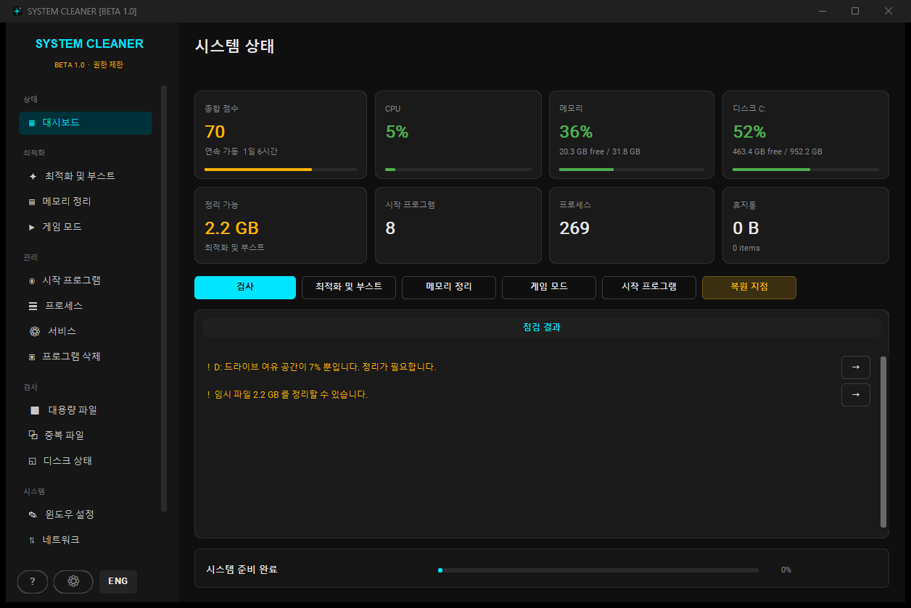 | 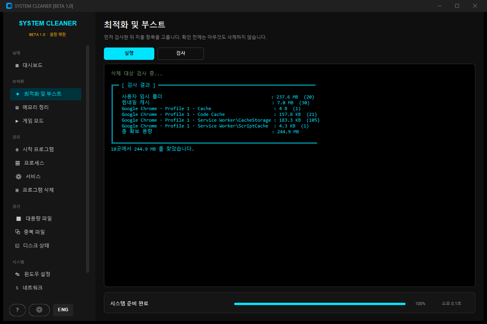 |
| 실시간 CPU·메모리·디스크, 종합 점수, 문제별 바로가기 | 검사 → 확인 → 삭제. 확인 전에는 아무것도 지우지 않음 |

| 시작 프로그램 | 서비스 |
|---|---|
| 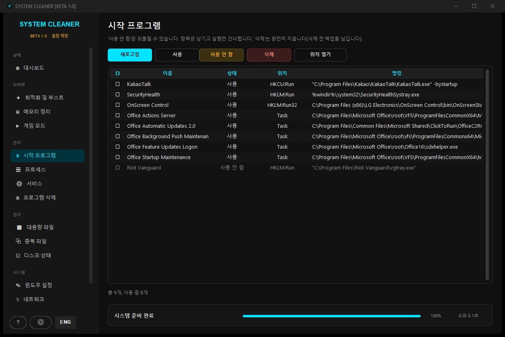 | 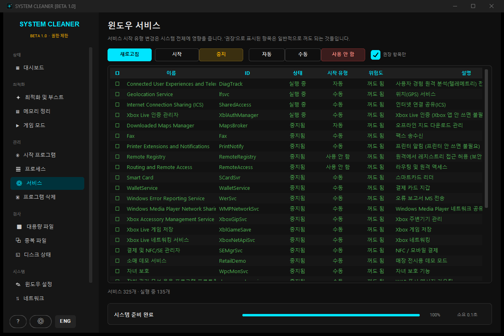 |
| 레지스트리 · 시작 폴더 · 작업 스케줄러. 파일 없는 항목은 빨강 | '꺼도 됨 / 주의 / 핵심' 분류와 한글 설명 |

| 프로그램 삭제 | 윈도우 설정 |
|---|---|
| 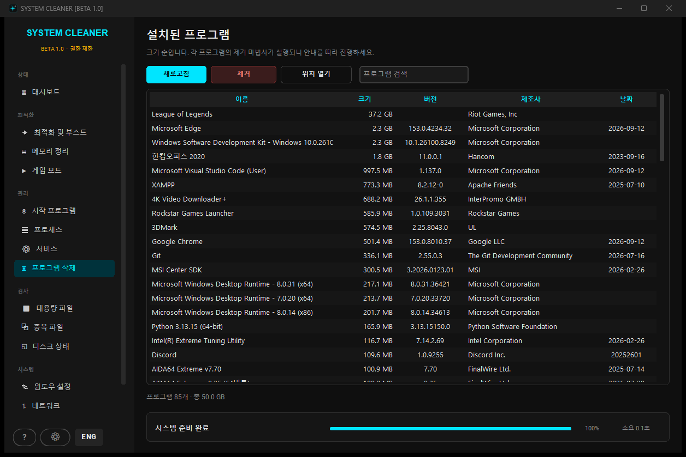 | 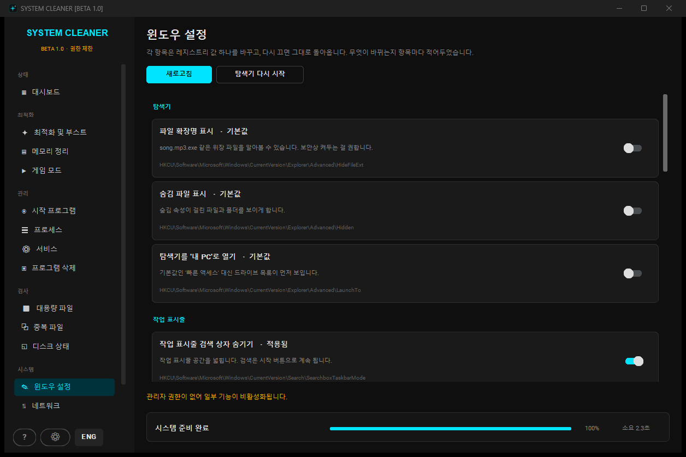 |
| 크기 순 정렬로 용량 차지하는 것부터 | 바뀌는 레지스트리 경로까지 표시 |

<details>
<summary>나머지 화면 보기</summary>

| | |
|---|---|
| 메모리 정리 | 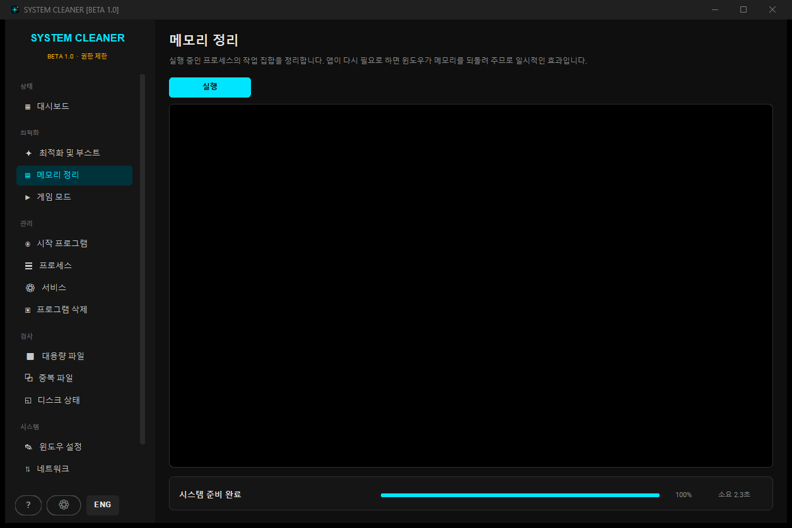 |
| 게임 모드 |  |
| 프로세스 | 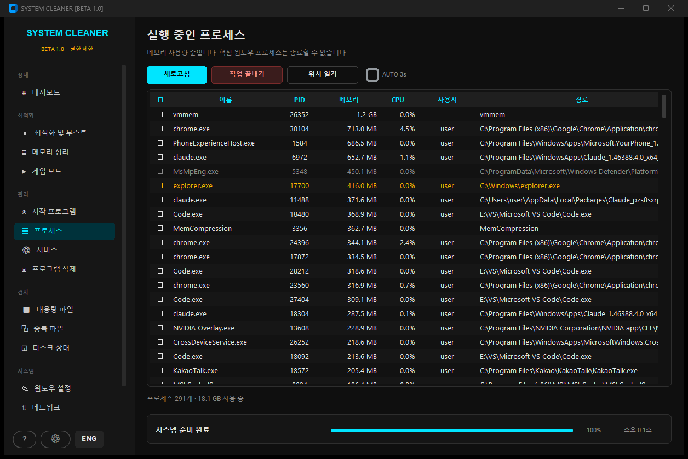 |
| 대용량 파일 | 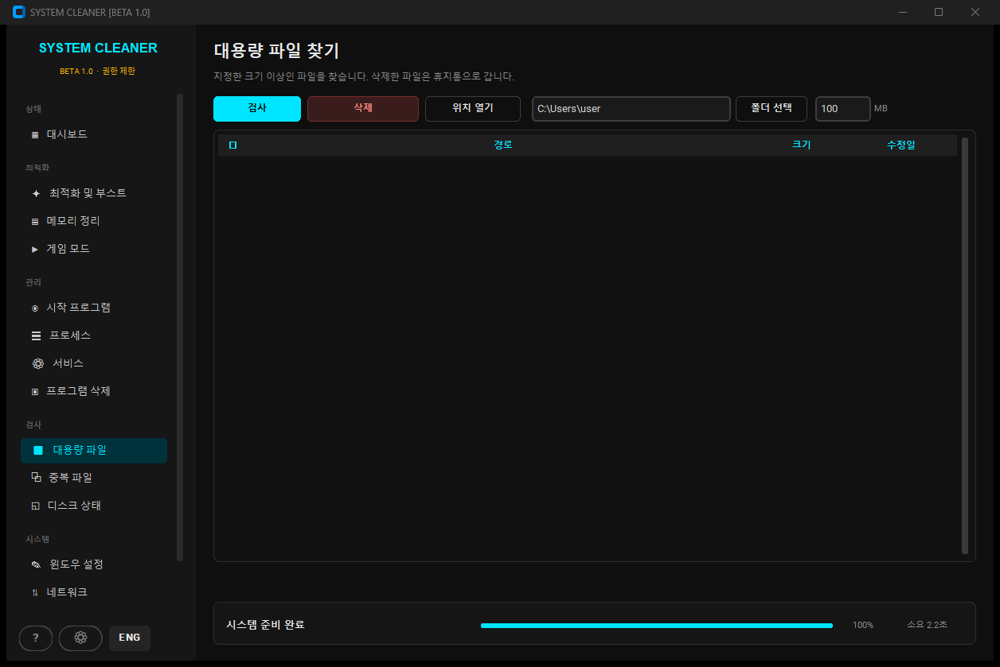 |
| 중복 파일 | 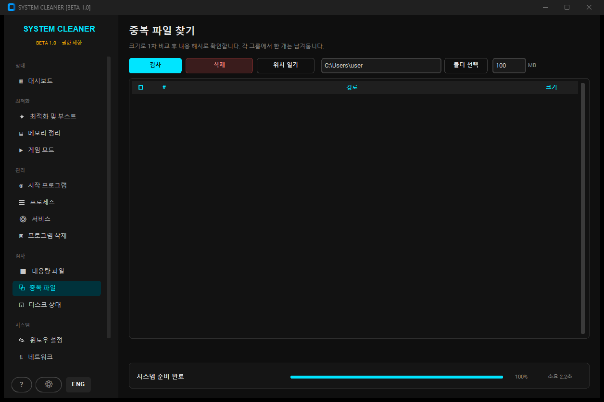 |
| 디스크 상태 | 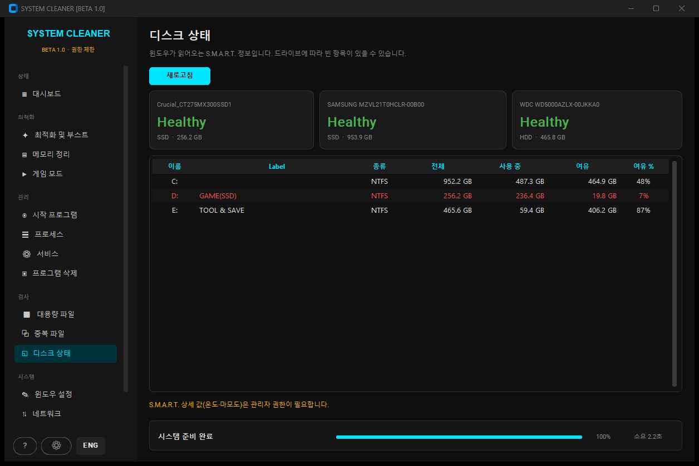 |
| 네트워크 | 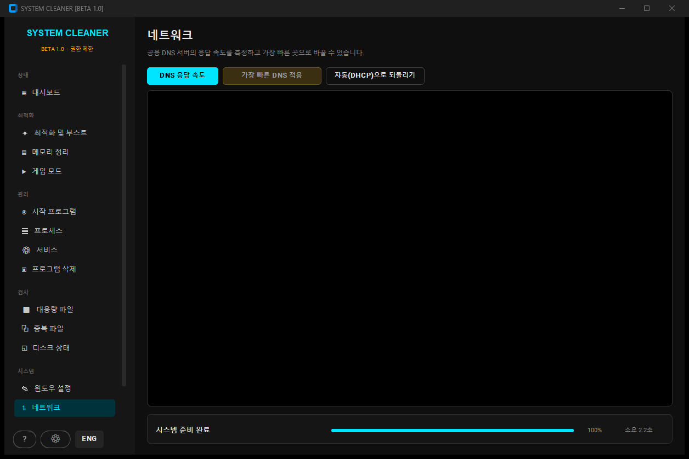 |
| 업데이트 | 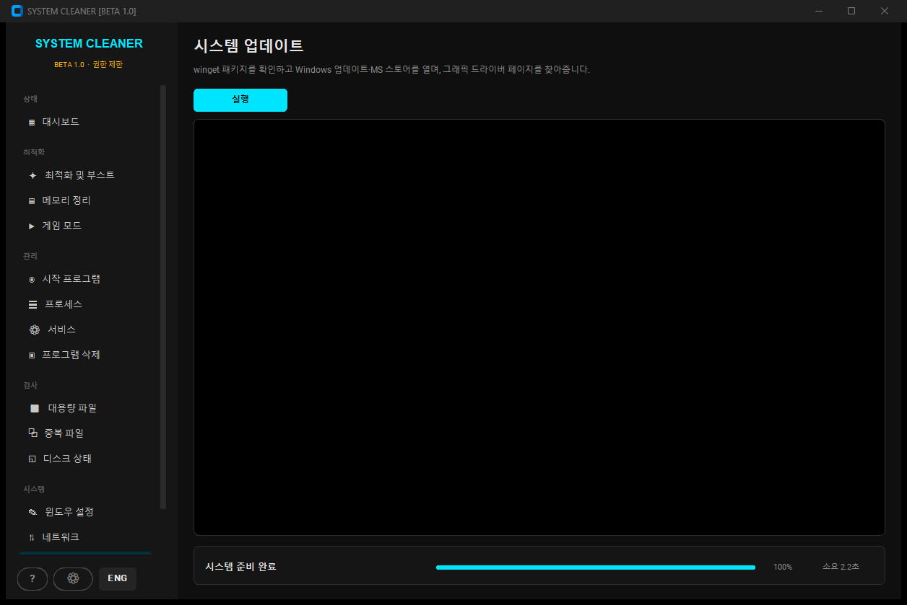 |
| 내 PC 정보 | 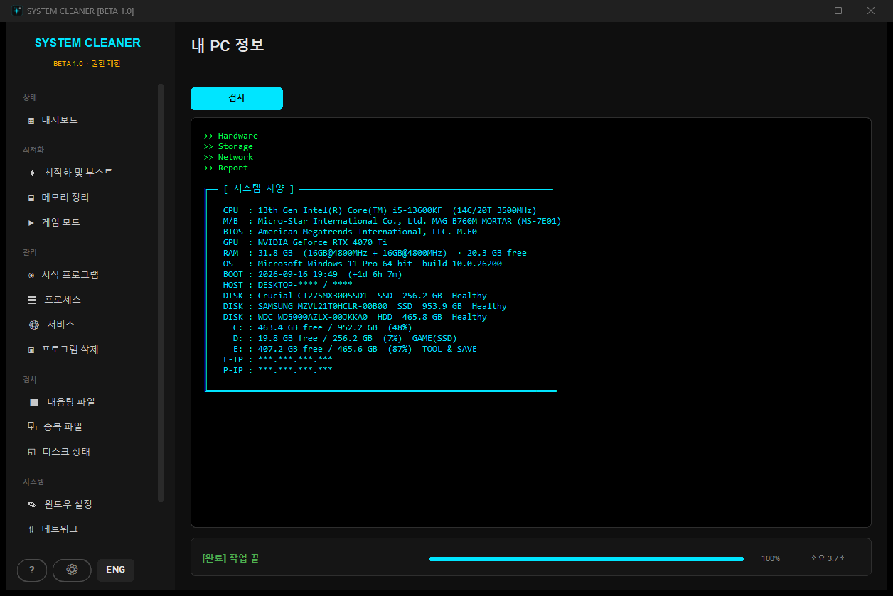 |

</details>

---

## 화면 구성

| 그룹 | 화면 | 하는 일 |
|---|---|---|
| 상태 | **대시보드** | CPU·메모리·디스크 실시간 표시, 종합 점수, 문제 항목별 바로가기 |
| 최적화 | **최적화 및 부스트** | 임시 파일·브라우저 캐시 검사 → 확인 → 삭제, DISM, SSD/HDD 구분 디스크 최적화 |
| | **메모리 정리** | 실행 중 프로세스의 작업 집합 정리, 전후 여유 메모리 실측 |
| | **게임 모드** | 실행 중인 배경 앱만 골라 정상 종료 → 강제 종료, 고성능 전원 관리 전환 |
| 관리 | **시작 프로그램** | 레지스트리 Run/RunOnce, 시작 폴더, 작업 스케줄러 로그온 항목 · 사용/사용 안 함/삭제 |
| | **프로세스** | 메모리·CPU 순 정렬, 작업 끝내기(핵심 프로세스는 보호) |
| | **서비스** | 325개 서비스 목록, '꺼도 됨/주의/핵심' 분류와 한글 설명, 시작 유형 변경 |
| | **프로그램 삭제** | 설치된 프로그램을 크기 순으로 정렬, 제거 마법사 실행 |
| 검사 | **대용량 파일** | 지정 폴더에서 큰 파일 찾기 → 휴지통으로 이동 |
| | **중복 파일** | 크기 → 앞부분 해시 → 전체 해시 3단계 비교, 그룹마다 하나는 자동 제외 |
| | **디스크 상태** | S.M.A.R.T.(상태·온도·마모도), 볼륨별 사용량 |
| 시스템 | **윈도우 설정** | 확장자 표시, 광고/추천 끄기, 게임 DVR, 마우스 가속 등 15개 토글 |
| | **네트워크** | 공용 DNS 6곳 응답 속도 측정 후 가장 빠른 곳으로 변경 |
| | **업데이트** | winget 업그레이드 목록 확인 → 실행, Windows 업데이트/스토어 열기, GPU 드라이버 페이지 |
| | **내 PC 정보** | CPU/메인보드/BIOS/GPU/RAM 구성/OS/디스크/IP |

---

## 설계 원칙

**1. 삭제 전에 먼저 보여준다**
청소는 검사 → 결과 표 → `1.8 GB 를 삭제합니다` 확인 → 실행 순서입니다.
파일을 지울 때는 영구 삭제 대신 **휴지통**으로 보냅니다.

**2. 되돌릴 수 있게 만든다**
시작 프로그램 '사용 안 함'은 항목을 지우지 않고 윈도우가 실제로 쓰는
`Explorer\StartupApproved` 플래그만 바꿉니다(작업 관리자와 같은 방식).
삭제·서비스 변경 전에는 `%APPDATA%\SystemCleaner\backup\` 에 JSON 백업을 남기고,
바꾼 내용은 `logs\audit_YYYYMM.log` 에 기록합니다.
위험한 작업 전에는 시스템 복원 지점을 만듭니다(설정에서 끌 수 있음).

**3. 위험한 건 기본으로 꺼둔다**
휴지통 비우기, winsock 초기화, Prefetch 삭제, 게임 모드에서 오피스 종료는
모두 기본 OFF 입니다. ⚙ 설정에서 켜야 동작합니다.

**4. 성공했다고 거짓말하지 않는다**
모든 외부 명령은 종료 코드를 확인해 성공/실패/시간 초과를 구분합니다.
실패하면 `FINISHED WITH ERRORS` 와 함께 사유를 남깁니다.

**5. 멈추지 않는다**
명령마다 타임아웃이 있고, `CANCEL` 버튼 또는 `ESC` 로 실행 중인 자식 프로세스까지 종료합니다.
UI 갱신은 전부 `app.ui()` → `after(0, ...)` 한 곳을 거칩니다(tkinter 는 스레드 세이프하지 않음).

---

## 구조

```
run.py                     진입점
system_cleaner/
  __main__.py              권한 승격 + 앱 실행
  core.py                  설정, 프로세스 실행기, 휴지통, 복원 지점, 감사 로그
  i18n.py                  한/영 문자열
  selftest.py              읽기 전용 자가 검사 (소스와 exe 공용)
  assets/icon.ico          앱 아이콘
  scan.py                  임시 파일 · 브라우저 캐시 · 대용량 · 중복 파일
  startup.py               시작 프로그램 (레지스트리 / 시작 폴더 / 작업 스케줄러)
  services.py              윈도우 서비스 + 권장 목록
  programs.py              설치된 프로그램 / 제거
  procs.py                 프로세스, 메모리 트림, 게임 모드
  sysinfo.py               하드웨어 · 디스크 S.M.A.R.T. · 네트워크
  tweaks.py                윈도우 설정 토글
  tasks.py                 오래 걸리는 작업 + TaskContext
  ui.py                    터미널 · 표 · 카드 · 확인 창
  app.py                   메인 창 / 네비게이션 / 작업 실행기
  pages_*.py               화면
tests/smoke_test.py        읽기 전용 스모크 테스트
legacy/                    alpha 버전 원본
```

## 테스트

```bash
python tests/smoke_test.py
```

```bash
SystemCleaner.exe --selftest 보고서.txt
```

검사 내용은 `system_cleaner/selftest.py` 한 곳에 있고, **소스와 빌드한 exe 에서 똑같이** 돌립니다.
exe 로 묶었을 때만 깨지는 것들(번들에서 빠진 테마 파일, 콘솔이 없어 사라지는 예외,
창 모드 exe 의 subprocess 핸들 문제)을 잡으려고 테스트를 패키지 안에 뒀습니다.

삭제·프로세스 종료·설정 변경은 호출하지 않는 읽기 전용 검사이며 50개 항목을 봅니다 —
번들 구성, 외부 명령 실행, 승격 명령 구성, 15개 화면 생성, 목록 로딩, 정렬, 언어 전환,
읽기 전용 작업 실행, 취소, 그리고 **검사 중 오류 로그에 예외가 하나도 안 쌓였는지**.

## 빌드

```bash
pyinstaller --noconfirm system_cleaner.spec
```

결과물은 `dist\SystemCleaner.exe` 입니다.

- `uac_admin=False` — 매니페스트로 관리자 권한을 강제하면 UAC 를 거절했을 때 앱이 아예 안 켜집니다.
  앱이 시작할 때 직접 승격을 요청하고, 거절하면 제한 모드로 엽니다.
- `upx=False` — UPX 압축은 백신 오탐을 크게 늘립니다.
- 버전 정보 포함 — 파일 속성에 제품명·버전이 보입니다. 버전 정보가 없는 서명 안 된 exe 는 휴리스틱 검사에서 더 의심받습니다.
- Pillow 제외 — customtkinter 가 선택적으로만 import 하고 이 앱은 쓰지 않아 용량만 늘립니다.
